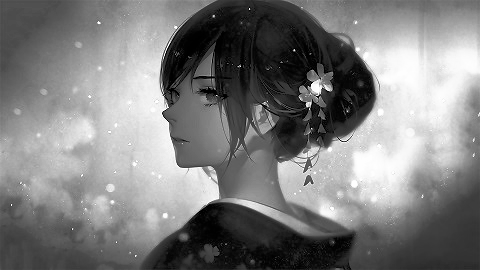
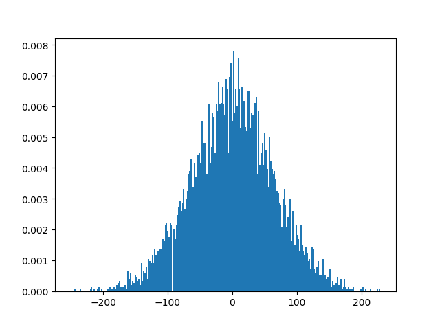

===================================
数字图像处理 BASICS
===================================

-----------------------------------
数字图像处理 - 通道
-----------------------------------

数字图像的本质
===================================

**数字图像** 的本质是一个 **多维矩阵**。

以一张 480x270 的RGB色彩空间图像为例，编写如下代码

::
    
    import scipy.misc

    mat = scipy.misc.imread('/DSP/jp.jpg')
    print(mat.shape)  # (270, 480, 3)

说明这个图像有 270 行，480 列，以及在色彩上有 3 个分量。

.. admonition:: imread 错误

    | 若出现错误 AttributeError: module 'scipy.misc' has no attribute 'imread' 
    | ref: https://blog.csdn.net/TeFuirnever/article/details/90760179

    | 解决方法一：降低 scipy 版本为 1.2.1，以配合 Pillow 版本 6.0.0 
    | 解决办法二：用新版本的写法，即

    ::

        import imageio  # 若没有该库就安装一下
        mat = imageio.imread('DSP/jp.jpg')
        mat.shape

进一步分解该图片得到 R, G, B 三个通道分量：

::

    import PIL.Image

    im = PIL.Image.open('/DSP/jp.jpg')
    r, g, b = im.split()

    r.show()
    g.show()
    b.show()

得到如下三张图片，每个分量单独拿出来都是一个 [270, 480, 1] 的矩阵

- R 通道的灰度图像
- G 通道的灰度图像
- B 通道的灰度图像

如你所见，它们并 **不是彩色的** ，而是一副 **灰度图像**

| R: http://accu.cc/img/pil/channel/jp_r.jpg
| G: http://accu.cc/img/pil/channel/jp_g.jpg
| B: http://accu.cc/img/pil/channel/jp_b.jpg

.. image ../../../../DSP/1_channels_RGB.jpg

.. image:: http://accu.cc/img/pil/channel/jp_r.jpg
.. image:: http://accu.cc/img/pil/channel/jp_g.jpg
.. image:: http://accu.cc/img/pil/channel/jp_b.jpg

交换通道
===================================

若交换一下分量放置的顺序，如把 B 分量放入红色通道、G 分量放入绿色通道、R 分量放入蓝色通道里，可得如下图像

::

    import PIL.Image

    im = PIL.Image.open('DSP/jp.jpg')
    r, g, b = im.split()

    im = PIL.Image.merge('RGB', (b, g, r))
    im.show()

.. image:: http://accu.cc/img/pil/channel/jp_bgr.jpg

除了交换通道顺序外，甚至可以传入自己定义的通道分量

::

    import PIL.Image

    im = PIL.Image.open('DSP/jp.jpg')
    _, g, b = im.split()

    # 创建一个新的 r 通道分量，注意 mode 值为 'L'
    r = PIL.Image.new('L', im.size, color=255)

    im = PIL.Image.merge('RGB', (r, g, b))
    im.show()

.. image:: http://accu.cc/img/pil/channel/jp_r255.jpg

学习通道的现实意义
===================================

e.g., 比如换掉电子证件照的背景幕布颜色

-----------------------------------
数字图像处理 - 均值
-----------------------------------

图像均值
===================================

在 PIL 中，使用如下方法获取图像均值：

::

    import PIL.Image
    import PIL.ImageStat

    im = PIL.Image.open('DSP/jp.jpg')
    mean = PIL.ImageStat.Stat(im).mean
    print(mean)
    # [98.61, 97.29, 100.91, 255.0], 每一项分别代表 RGBA

图像均值在以下方面具有重要意义：

**特征标准化.** 对于图像, 逐像素减去均值, 这种归一化可以移除图像的平均亮度值. 很多情况下我们对图像的照度并不感兴趣, 而更多地关注其内容, 这时对每个 数据点移除像素的均值是有意义的. 注意: 虽然该方法广泛地应用于图像, 但在处理彩色图像时需要格外小心, 具体来说, 是因为不同色彩通道中的像素并不都存在平稳特性. 在 *图像处理-字符画* 一文中有使用例程.

**均值滤波.** 均值滤波是典型的线性滤波算法, 它是指在图像上对目标像素给一个模板, 该模板包括了其周围的临近像素(以目标象素为中心的周围 8 个像素, 构成 一个滤波模板, 即去掉目标像素本身), 再用模板中的全体像素的平均值来代替原来像素值.

**主题色提取.** 像 Windows10, 部分定制化 Android 操作系统会根据桌面背景自动更改系统主题色.

-----------------------------------
数字图像处理 - 对比增强
-----------------------------------

幂次变换
===================================

假设原图像为 r, 目标图像为 s, 转换函数为 T, 可使用形式如下的表达式表示: :math:`s=T(r)`

幂次变换转换函数的基本形式为 :math:`s=cr^\lambda`, 其中 :math:`c` 和 :math:`\lambda` 为正常数. 幂次变换是常用的图像 **对比度调整** 算法中的一种.

.. image:: http://accu.cc/img/pil/contrast/power_law.jpg

由图可以看出, 

- 当 :math:`\lambda < 1` 时, 幂次变换将窄带输入暗值映射到宽带输出, 将宽带输入亮值映射到窄带输出值; 
- 当 :math:`\lambda > 1` 时, 幂次变换将宽带输入暗值映射到窄带输出值, 将窄带输入亮值映射到宽带输出值; 
- 当 :math:`\lambda = 1` 时, 即为正比变换.

代码实现
===================================

当原图像在暗处细节较多，并且希望忽略一部分亮处细节时，可取 :math:`c=1, \, \lambda=0.67.`

::

    import PIL.Image
    import scipy.misc
    import numpy as np

    def convert_3d(r):
        s = np.empty(r.shape, dtype=np.uint8)
        for j in range(r.shape[0]):
            for i in range(r.shape[1]):
                s[j][i] = (r[j][i] / 255) ** 0.67 * 255
        return s

    im = PIL.Image.open('DSP/jp.jpg')
    im_mat = np.asarray(im)
    im_converted_mat = convert_3d(im_mat)
    im_converted = PIL.Image.fromarray(im_converted_mat)
    im_converted.show()

效果展示
===================================

原图整体较为昏暗，且在图像暗处有较多细节

.. image:: http://accu.cc/img/pil/contrast/sample1.jpg

经过 :math:`c=1, \lambda=0.67` 幂次变换后，暗处的细节可清晰展现

.. image:: http://accu.cc/img/pil/contrast/sample2.jpg

原图整体较为明亮，且在图像亮处有较多细节

.. image:: http://accu.cc/img/pil/contrast/sample3.jpg

经过 :math:`c=1, \lambda=1.5` 幂次变换后，亮处的细节可清晰展现 (观察图像左侧的花与女孩发梢)

.. image:: http://accu.cc/img/pil/contrast/sample4.jpg

-----------------------------------
数字图像处理 - 对比拉伸
-----------------------------------

对比拉伸
===================================

低对比度的图像可由照明不足，成像传感器动态范围太小，甚至在图像获取过程中透镜光圈设置错误引起。
对比拉伸的思想是提高图像处理时灰度级的动态范围。

转换函数
===================================

:math:`T(x) = \frac{ x - r_{min} }{ r_{max} - r_{min} } \cdot 255`

该函数将原图像 :math:`[r_{min}, r_{max}]` 的像素取值范围拉伸至 :math:`[0, 255]`.

代码实现
===================================

::

    import PIL.Image
    import scipy.misc
    import numpy as np

    def convert_2d(r):
        rmin = np.min(r)
        rmax = np.max(r)
        if rmin == rmax:
            return r
        s = np.empty(r.shape, dtype=np.uint8)
        for j in range(r.shape[0]):
            for i in range(r.shape[1]):
                s[j][i] = (r[j][i] - rmin) / (rmax - rmin) * 255
        return s

    def convert_3d(r):
        s_dsplit = []
        for d in range(r.shape[2]):
            rr = r[:, :, d]
            ss = convert_2d(rr)
            s_dsplit.append(ss)
        s = np.dstack(s_dsplit)
        return s

    im = PIL.Image.open('DSP/jp.jpg')
    im_mat = np.asarray(im)
    im_converted_mat = convert_3d(im_mat)
    im_converted = PIL.Image.fromarray(im_converted_mat)
    im_converted.show()

-----------------------------------
数字图像处理 - 位图切割
-----------------------------------

位图切割
===================================

设一幅灰度图像中的每一个像素都由 8 比特表示，则图像转换为由 8 张 1 比特平面组成，其范围从最低有效位的位平面 0 到最高有效位的位平面 7. 
在 8 比特字节中，平面 0 包含图像中像素的最低有效位，而平面 7 则包含最高有效位。
较高阶位 (尤其是前 4 位) 包含了大多数在视觉上很重要的数据。

代码实现
===================================

::

    import PIL.Image
    import scipy.misc
    import numpy as np

    flat = 7

    def convert_2d(r):
        s = np.empty(r.shape, dtype=np.uint8)
        for j in range(r.shape[0]):
            for i in range(r.shape[1]):
                bits = bin(r[j][i])[2:].rjust(8, '0')
                fill = int(bits[-flat - 1])
                s[j][i] = 255 if fill else 0
        return s

    im = PIL.Image.open('DSP/jp.jpg')
    im = im.convert('L')
    im_mat = np.asarray(im)
    im_converted_mat = convert_2d(im_mat)
    im_convert = PIL.fromarray(im_converted_mat)
    im_convert.show()

实验结果
===================================

原图

.. image:: http://accu.cc/img/pil/bit/jp.jpg

| 第 7 个位平面
| 第 6 个位平面

.. image:: http://accu.cc/img/pil/bit/jp_bit7.jpg
.. image:: http://accu.cc/img/pil/bit/jp_bit6.jpg

| 第 5 个位平面
| 第 4 个位平面

.. image:: http://accu.cc/img/pil/bit/jp_bit5.jpg
.. image:: http://accu.cc/img/pil/bit/jp_bit4.jpg

| 第 3 个位平面
| 第 2 个位平面

.. image:: http://accu.cc/img/pil/bit/jp_bit3.jpg
.. image:: http://accu.cc/img/pil/bit/jp_bit2.jpg

| 第 1 个位平面
| 第 0 个位平面

.. image:: http://accu.cc/img/pil/bit/jp_bit1.jpg
.. image:: http://accu.cc/img/pil/bit/jp_bit0.jpg

-----------------------------------
数字图像处理 - 直方图均衡化
-----------------------------------

直方图均衡化
===================================

直方图均衡化处理的 **中心思想** 是把原始图像的灰度直方图从比较集中的某个灰度区间变成在全部灰度范围内的均匀分布. 
直方图均衡化就是对图像进行非线性拉伸, 重新分配图像像素值, 使一定灰度范围内的像素数量大致相同. 
直方图均衡化就是把给定图像的直方图分布改变成"均匀"分布直方图分布.

假设输入是一张 8 比特灰度图 (即灰度级为 0 至 255), 则任意灰度级的概率函数为
:math:`P(r_k) = \frac{ n_k }{n} ,\, k\in [0,255]`

其中 :math:`n_k` 为灰度级为 *k* 的像素个数, *n* 为总像素个数. 设转换函数为 *T*, 则
:math:`s_k = T(n_k) = 255 \sum_{j=0}^k \frac{ n_j }{n}`

代码实现
===================================

::

    import matplotlib.pyplot as plt
    import numpy as np
    import PIL.Image
    import scipy.misc

    def convert_2d(r):
        x = np.zeros([256])
        for i in range(r.shape[0]):
            for j in range(r.shape[1]):
                x[r[i][j]] += 1
        x = x / r.size

        sum_x = np.zeros([256])
        for i, _ in enumerate(x):
            sum_x[i] = sum(x[: i])

        s = np.empty(r.shape, dtype=np.uint8)
        for i in range(r.shape[0]):
            for j in range(r.shape[1]):
                s[i][j] = 255 * sum_x[r[i][j]]
        return s

    im = PIL.Image.open('DSP/jp.jpg')
    im = im.convert('L')
    im_mat = np.asarray(im)

    # 显示输入直方图
    plt.hist(im_mat.reshape([im_mat.size]), 255, normed=1)
    plt.show()

    im_converted_mat = convert_2d(im_mat)

    # 显示输出直方图
    plt.hist(im_converted_mat.reshape([im_converted_mat.size]), 256, normed=1)
    plt.show()

    im_converted = PIL.Image.fromarray(im_converted_mat)
    im_converted.show()

实验结果
===================================

原始直方图

.. image:: http://accu.cc/img/pil/histogram_equalization/hist.jpg

直方图均衡化后的直方图，可以看到图像分布变得均匀

.. image:: http://accu.cc/img/pil/histogram_equalization/hist_converted.jpg

| `im.convert('L')` 后的图像
| 最终 `im_converted` 的图像

-----------------------------------
数字图像处理 - 图像减法
-----------------------------------

图像减法
===================================

两幅图像 :math:`f(x,y)` 与 :math:`h(x,y)` 的差异表示为：
:math:`g(x,y) = f(x,y) - h(x,y)`

图像的差异是通过计算这两幅图像所有对应像素点的差而得出的。
减法处理最主要的作用就是增强两幅图像的差异。
在差值图像中，像素最小取值为 -255，最大取值为 255。
因此显示这一图像需要某种标度。
首先提取最小差值，并且把它的负值加到差值图像的所有像素中，
然后通过 255/Max 值去乘每个像素 (其中 Max 为改进的差值图像中最大像素取值) 将图像中所有像素标定到 0 到 255 范围中。

注意事项
===================================

在 Numpy 中图像存储类型是 uint8，范围是 0-255，
如果图像相减后得到负值，就会截取为 0 值。
因此在处理差值图像时需要将数据以 float 保存。
处理完成后再转换为 uint8. 

代码实现
===================================

:: 

    # 取得原图与其高斯模糊图像的差值图像
    import PIL.Image
    import PIL.ImageFilter
    import scipy.misc
    import numpy as np

    def convert_2d(r, h):
        # 矩阵减法
        s = r - h
        if np.min(s) >= 0 and np.max(s) <= 255:
            return s
        # 线性拉伸
        s = s - np.full(s.shape, np.min(s))
        s = s * 255 / np.max(s)
        s = s.astype(np.uint8)
        return s

    def convert_3d(r, h):
        s_dsplit = []
        for d in range(r.shape[2]):
            rr = r[:, :, d]
            hh = h[:, :, d]
            ss = convert_2d(rr, hh)
            s_dsplit.append(ss)
        s = np.dstack(s_dsplit)
        return s

    im = PIL.Image.open('DSP/jp.jpg')
    im = im.convert('RGB')
    im_mat = np.asarray(im)
    # 高斯模糊
    im_converted = im.filter(PIL.ImageFilter.GaussianBlur(radius=2))
    im_converted_mat = scipy.misc.fromimage(im_converted)
    im_sub_mat = convert_3d(im_mat, im_converted_mat)
    im_sub = PIL.Image.fromarray(im_sub_mat)
    im_sub.show()

.. admonition:: imread 错误

    若出现错误 AttributeError: module 'scipy.misc' has no attribute 'fromimage' 

    这是 scipy 的版本问题，可以使用 np.asarray 来代替，并保存图片，即

    ::

        im_converted_mat = np.asarray(im_converted)
        im_converted.save('./1_sub.jpg', quality=95)

        im_converted.save('./1_sub.jpg', quality=95, subsampling=0)

    ref: https://blog.csdn.net/weixin_41935140/article/details/83308359

    | 在保存为 JPG/JPEG 格式时，使用默认参数可能会发现图片被严重压缩，使得图片大小被压缩至几十K，其原因在于保存过程中使用压缩算法对图片进行了压缩处理。
    | 若希望图片大小不能变化太大，可使用参数 quality 和 subsampling。

    - quality 参数：保存图片的质量，默认值为 75，范围从 1 (最差) 到 95 (最佳)。使用中应尽量避免高于95的值，100会禁用部分JPEG压缩算法，并导致大文件图像质量几乎没有任何增益。
    - subsampling 参数：子采样，通过实现色度信息的分辨率低于亮度信息来对图像进行编码的实践。可能的子采样值是 0,1 和 2，分别对应于 4:4:4, 4:2:2 和 4:1:1 (或 4:2:0?)。实践中设为 0 即可满足增大图片大小的需求。

**输出结果**

.. image:: http://accu.cc/img/pil/sub/sub.jpg

高斯模糊图像

-----------------------------------
数字图像处理 - 加性高斯白噪声与去噪
-----------------------------------

加性高斯白噪声
===================================

加性高斯白噪声 (Additive white Gaussian noise，AWGN) 在通信领域中指的是一种 **功率谱函数是常数 (即白噪声), 且幅度服从高斯分布** 的噪声信号. 这类噪声通常来自感光元件, 且无法避免. 

加噪
===================================

Numpy 中使用 `numpy.random.normal()` 函数生成正态分布数据。

::

    import numpy as np
    import matplotlib.pyplot as plt

    # 生成均值为 0，标准差为 64 的正态分布数据
    data = np.random.normal(0, 64, 1024 * 8)

    # 在 plt 中画出直方图
    plt.hist(data, 256, normed=1)
    plt.show()

为图像添加高斯白噪声. 注意到添加完噪声的图像, 像素值可能低于 0 或高于 255, 此时应该对转换后的图像做一次对比拉伸.

::

    import PIL.Image
    import scipy.misc
    import numpy as np

    def convert_2d(r):
        # 添加均值为 0，标准差为 64 的加性高斯白噪声
        s = r + np.random.normal(0, 64, r.shape)
        if np.min(s) >= 0 and np.max(s) <= 255:
            return s
        # 对比拉伸
        s = s - np.full(s.shape, np.min(s))
        s = s * 255 / np.max(s)
        s = s.astype(np.uint8)
        return s

    def convert_3d(r):
        s_dsplit = []
        for d in range(r.shape[2]):
            rr = r[:, :, d]
            ss = convert_2d(rr)
            s_dsplit.append(ss)
        s = np.dstack(s_dsplit)
        return s

    im = PIL.Image.open('DSP/jp.jpg')
    im = im.convert('RGB')
    im_mat = np.asarray(im)
    im_converted_mat = convert_3d(im_mat)
    im_converted = PIL.Image.fromarray(im_converted_mat)
    im_converted.show()

**加噪后的图像**

.. image:: http://accu.cc/img/pil/agwn/jp_agwn.jpg

高斯噪声的直方图

去噪
===================================

| 考虑一幅将噪声 :math:`\eta(x,y)` 加入到原始图像 :math:`f(x,y)` 形成的带有噪声的图像 :math:`g(x,y)` ，即：
| :math:`g(x,y) = f(x,y) + \eta(x,y)`

| 这里假设每个坐标点 :math:`(x,y)` 上的噪声都不相关且均值为 0. 
| 我们处理的目标就是通过人为加入一系列噪声图像 :math:`g_i(x,y)` 来减少噪声。
| 如果对 K 幅带有不同噪声的图像取平均值，即
| :math:`\bar{g}(x,y) = \frac{1}{K} \sum_{i=1}^K g_i(x,y) = f(x,y) + \frac{1}{K} \sum_{i=1}^K \eta_i(x,y)`

当 K 足够大时， :math:`\frac{1}{K} \sum_{i=1}^K \eta_i(x,y)` 趋近于 0，因此
:math:`\bar{g}(x,y) = f(x,y)`

下面尝试对上述图片取 K=128 进行去噪

::

    import PIL.Image
    import scipy.misc
    import numpy as np

    def convert_2d(r):
        # 添加均值为 0，标准差为 64 的加性高斯白噪声
        s = r + np.random.normal(0, 64, r.shape)
        if np.min(s) >= 0 and np.max(s) <= 255:
            return s
        # 对比拉伸
        s = s - np.full(s.shape, np.min(s))
        s = s * 255 / np.max(s)
        s = s.astype(np.uint8)
        return s

    def convert_3d(r):
        s_dsplit = []
        for d in range(r.shape[2]):
            rr = r[:, :, d]
            ss = convert_2d(rr)
            s_dsplit.append(ss)
        s = np.dstack(s_dsplit)
        return s

    im = PIL.Image.open('DSP/jp.jpg')
    im_mat = np.asarray(im)

    k = 128

    im_converted_mat = np.zeros(im_mat.shape)
    for i in range(k):
        im_converted_mat += convert_3d(im_mat)

    im_converted_mat = im_converted_mat / k
    im_converted_mat = im_converted_mat - np.full(im_converted_mat.shape, np.min(im_converted_mat))
    im_converted_mat = im_converted_mat * 255 / np.max(im_converted_mat)
    im_converted_mat = im_converted_mat.astype(np.uint8)

    im_converted = PIL.Image.fromarray(im_converted_mat)
    im_converted.show()

**去噪后的图像**

.. image:: http://accu.cc/img/pil/agwn/jp_denoise.jpg

可见去噪后的图像已十分接近于原始图像了。
读者可自由选取 K=4, K=16 等不同值查看去噪效果。

| K = 64
| K = 32

| K = 16
| K = 4

