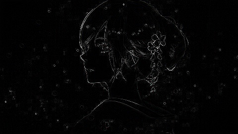
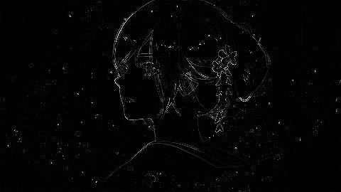

===================================
数字图像处理 - 空间滤波
===================================

-----------------------------------
空间滤波基础
-----------------------------------

某些邻域处理工作是操作邻域的图像像素值以及相应的与邻域有相同维数的子图像的值. 这些子图像可以被称为 **滤波器, 掩模, 核, 模板** 或 **窗口**. 在滤波器子图像中的值是系数, 而不是像素值.

空间滤波的机理就是在待处理图像上逐点地移动掩模. 在每一点, 滤波器的响应通过事先定义的关系来计算. 对于线性空间滤波, 其相应由滤波器系数与滤波掩模扫过区域的相应像素值的乘积之和给出.

.. image:: http://accu.cc/img/pil/spatial_filter/spatial_filter.jpg

线性空间滤波处理经常被称为"掩模与图像的卷积", 类似的, 滤波模板有时也成为"卷积模板", "卷积核" 一词也常用于此.

实现空间滤波邻域处理时的一个重要考虑因素就是 **滤波中心靠近图像轮廊时发生的情况**. 

考虑一个简单的大小为 n * n 的方形掩模, 当掩模中心距离图像边缘为 (n-1)/2 个像素时, 该掩模至少有一条边与图像轮廓相重合. 
如果掩模的中心继续向图像边缘靠近,那么掩模的行或列就会处于图像平面之外. 有很多方法可以处理这种问题. 

- 最简单的方法就是将掩模中心点的移动范围限制在距离图像边缘不小于 (n-1)/2个像素处. 这种做法将使处理后的图像比原始图像稍小, 滤波后的图像中的所有像素点都由整个掩模处理. 
- 如果要求处理后的输出图像与原始图像一样大, 那么所采用的典型方法是, 用全部包含于图像中的掩模部分滤波所有像素. 通过这种方法, 图像靠近边缘部分的像素带将用部分滤波掩模来处理. 
- 另一种方法就是在图像边缘以外再补上一行和一列灰度为零的像素点(其灰度也可以为其他常值), 或者将边缘复制补在图像之外. 补上的那部分经过处理后去除. 这种方法保持了处现后的图像弓原始图像尺寸大小相等, 但是补在靠近图像边缘的部分会带来不良影响, 这种影响随着掩模尺寸的增加而增大. 

总之, 获得最佳滤波效果的惟一方法是使滤波掩模屮心距原图像边缘的距离不小于 (n-1)/2 个像素.

-----------------------------------
空间滤波 - 均值滤波
-----------------------------------

均值滤波
===================================

均值滤波器的输出是包含在滤波掩模领域内像素的简单平均值. 均值滤波器最常用的目的就是 **减噪**. 
然而, 图像边缘也是由图像灰度尖锐变化带来的特性, 所以均值滤波还是存在不希望的 **边缘模糊负面效应**.

均值滤波还有一个重要应用, **为了对感兴趣的图像得出一个粗略描述而模糊一幅图像**. 这样, 那些较小物体的强度与背景揉合在一起了, 较大物体变得像斑点而易于检测. 掩模的大小由即将融入背景中的物体尺寸决定.

代码实现
===================================

使用一个 3*3 均值滤波器处理图像

::

    import numpy as np
    import PIL.Image
    import scipy.misc
    import scipy.signal

    def convert_2d(r):
        n = 3
        # 3*3 滤波器，每个系数都是 1/9
        window = np.ones((n, n)) / n ** 2
        # 使用滤波器卷积图像
        # mode = same 表示输出尺寸等于输入尺寸
        # boundary 表示采用对称边界条件处理图像边缘
        s = scipy.signal.convolve2d(r, window, mode='same', boundary='symm')
        return s.astype(np.uint8)

    def convert_3d(r):
        s_dsplit = []
        for d in range(r.shape[2]):
            rr = r[:, :, d]
            ss = convert_2d(rr)
            s_dsplit.append(ss)
        s = np.dstack(s_dsplit)
        return s

    im = PIL.Image.open('DSP/jp.jpg')
    im_mat = np.asarray(im)
    im_converted_mat = convert_3d(im_mat)
    im_converted = PIL.Image.fromarray(im_converted_mat)
    im_converted.show()

-----------------------------------
空间滤波 - 中值滤波
-----------------------------------

中值滤波
===================================

中值滤波是一种非线性空间滤波器, 它的响应基于图像滤波器包围的图像区域中像素的统计排序, 然后由统计排序结果的值代替中心像素的值. 
中值滤波器将其像素邻域内的灰度中值代替代替该像素的值. 

中值滤波器的使用非常普遍, 这是因为对于一定类型的随机噪声, 它提供了一种优秀的去噪能力, 比小尺寸的均值滤波器模糊程度明显要低. 中值滤波器对处理脉冲噪声(也称椒盐噪声)非常有效, 因为该噪声是以黑白点叠加在图像上面的.

与中值滤波相似的还有最大值滤波器和最小值滤波器.

代码实现
===================================

10 * 10 的中值滤波器实现

::

    import numpy as np
    import PIL.Image
    import scipy.misc
    import scipy.ndimage

    def convert_2d(r):
        n = 10
        s = scipy.ndimage.median_filter(r, (n, n))
        return s.astype(np.uint8)

    def convert_3d(r):
        s_dsplit = []
        for d in range(r.shape[2]):
            rr = r[:, :, d]
            ss = convert_2d(rr)
            s_dsplit.append(ss)
        s = np.dstack(s_dsplit)
        return s

    im = PIL.Image.open('/img/jp.jpg')
    im_mat = np.asarray(im)
    im_converted_mat = convert_3d(im_mat)
    im_converted = PIL.Image.fromarray(im_converted_mat)
    im_converted.show()

效果展示
===================================

中值滤波能产生类似油彩一样的效果, 如下是使用 10 * 10 中值滤波器处理后的图像

.. image:: http://accu.cc/img/pil/spatial_filter_medium/sample1.jpg

如下是使用中值滤波去除椒盐噪声的示例. 从左至右分别为 **原始图像**, 加入 **椒盐噪声** 后的图像, **均值滤波** 后的图像与 **中值滤波** 后的图像

.. image:: http://accu.cc/img/pil/spatial_filter_medium/sample2.jpg

.. admonition:: 椒盐噪声

    ref: https://zh.wikipedia.org/wiki/%E6%A4%92%E7%9B%90%E5%99%AA%E5%A3%B0

    **椒盐噪声** 也称为 **脉冲噪声**，是图像中经常见到的一种噪声，它是一种随机出现的白点或者黑点，可能是亮的区域有黑色像素或是在暗的区域有白色像素（或是两者皆有）。椒盐噪声的成因可能是影像讯号受到突如其来的强烈干扰而产生、模数转换器或位元传输错误等。例如失效的感应器导致像素值为最小值，饱和的感应器导致像素值为最大值。

    常用的去除这种噪声的有效手段是使用中值滤波器。下面的实例图像分别是原始图像、带有椒盐噪声的图像、经过平均滤波器修复的图像以及经过中值滤波器修复的图像。

.. admonition:: 最大值最小值滤波

    ref: https://docs.scipy.org/doc/scipy/reference/ndimage.html

    ::

        s = scipy.ndimage.median_filter(r, (n, n))
        # s = scipy.ndimage.minimum_filter(r, (n, n))
        # s = scipy.ndimage.maximum_filter(r, (n, n))
        # s = scipy.ndimage.percentile_filter(r, 50, (n, n))
        # s = scipy.ndimage.rank_filter(r, 3, (n, n))
        # s = scipy.ndimage.uniform_filter(r, (n, n))

    median_filter

    .. image:: ../../../DSP/2_filter_median_medi.jpg

    | minimum_filter
    | maximum_filter

    .. image:: ../../../DSP/2_filter_median_min.jpg
    .. image:: ../../../DSP/2_filter_median_max.jpg

    | percentile_filter
    | rank_filter
    | uniform_filter

    .. image:: ../../../DSP/2_filter_median_perc.jpg
    .. image:: ../../../DSP/2_filter_median_rank.jpg
    .. image:: ../../../DSP/2_filter_median_unif.jpg

-----------------------------------
空间滤波 - 锐化滤波
-----------------------------------

锐化滤波
===================================

在数学中, 微分是对函数的局部变化率的一种线性描述. 微分可以近似地描述当函数自变量的取值作足够小的改变时, 函数的值是怎样改变的. 最简单的各向同性微分算子是拉普拉斯算子. 一个二元图像函数 :math:`f(x,y)` 的拉普拉斯变换定义为 
:math:`\nabla^2 f = \frac{ \partial^2 f }{ \partial x^2 } + \frac{ \partial^2 f }{ \partial y^2 }`

因为任意阶微分都是线性操作, 所以拉普拉斯变换也是一个线性操作.

| 为了更适合于图像处理, 这一方程必须表现为离散形式. 考虑到有两个变量, 因此, 
| 我们在 x 方向上对二阶偏微分采用下列定义: :math:`\frac{\partial^2 f}{\partial x^2} = f(x+1,y) + f(x-1,y) - 2f(x,y)`
| 类似的, 在 y 方向上为 :math:`\frac{\partial^2 f}{\partial y^2} = f(x,y+1) + f(x,y-1) - 2f(x,y)`

因此 
:math:`\nabla^2f = f(x+1,y)+f(x-1,y) + f(x,y+1)+f(x,y-1) - 4f(x,y)`

因此，执行这一新定义的掩膜如下 
:math:`\begin{bmatrix}
0 & 1 & 0 \\
1 & -4 & 1\\
0 & 1 & 0
\end{bmatrix}`

由于拉普拉斯算子是一种微分算子, 它的应用强调图像中灰度的突变和降低灰度慢变化的区域. 这将产生一幅把图像中的浅灰色边线和突变点叠加到暗背景中的图像. 将原始图像和拉普拉斯图像叠加在一起的简单方法可以保护拉普拉斯锐化后的效果, 同时又能复原背景信息.

除上述的淹膜外, 常见拉普拉斯算子还有

:math:`\begin{bmatrix}
0 & -1 & 0 \\
-1 & 4 & -1\\
0 & -1 & 0
\end{bmatrix}`

:math:`\begin{bmatrix}
-1 & -1 & -1 \\
-1 & 8 & -1\\
-1 & -1 & -1
\end{bmatrix}`

:math:`\begin{bmatrix}
1 & 1 & 1 \\
1 & -8 & 1\\
1 & 1 & 1
\end{bmatrix}`

使用拉普拉斯算子对图像进行增强的基本表示方法如下

:math:`g(x, y)=
\begin{cases}
f(x, y) - \nabla ^2f(x, y) & \text{拉普拉斯算子中心系数为负} \\
f(x, y) + \nabla ^2f(x, y) & \text{拉普拉斯算子中心系数为正}
\end{cases}`

代码实现
===================================

在机理中, 我们首先使用拉普拉斯算子过滤图像, 然后, 从原图像中减去该图像. 但在实际使用中, 通常使用单一掩膜扫描来实现. 假设使用 1 号拉普拉斯算子, 代入机理最后一步, 得到
:math:`\begin{align}
g(x, y) =& f(x, y) - \nabla ^2f(x, y) \\
=& 5f(x, y) - [f(x+1, y) + f(x-1, y) + f(x, y+1) + f(x, y-1)]
\end{align}`

因此, :math:`g(x,y)` 可以视为 :math:`f(x,y)` 经过
:math:`\begin{bmatrix}
0 & -1 & 0 \\
-1 & 5 & -1\\
0 & -1 & 0
\end{bmatrix}` 
过滤得到.

::

    import numpy as np
    import PIL.Image
    import scipy.misc
    import scipy.signal

    def convert_2d(r):
        # 滤波掩模
        window = np.array([
            [0, -1, 0],
            [-1, 5, -1],
            [0, -1, 0]
        ])
        s = scipy.signal.convolve2d(r, window, mode='same', boundary='symm')
        # 像素值如果大于 255 则取 255, 小于 0 则取 0
        for i in range(s.shape[0]):
            for j in range(s.shape[1]):
                s[i][j] = min(max(0, s[i][j]), 255)
        s = s.astype(np.uint8)
        return s

    def convert_3d(r):
        s_dsplit = []
        for d in range(r.shape[2]):
            rr = r[:, :, d]
            ss = convert_2d(rr)
            s_dsplit.append(ss)
        s = np.dstack(s_dsplit)
        return s

    im = PIL.Image.open('DSP/jp.jpg')
    im_mat = np.asarray(im)
    im_converted_mat = convert_3d(im_mat)
    im_converted = PIL.Image.fromarray(im_converted_mat)
    im_converted.show()

效果展示
===================================

使用拉普拉斯算子对图像进行滤波, 得到图像像素突变部分(边缘)信息

.. image:: http://accu.cc/img/pil/spatial_filter_sharpening/sample1.jpg

将经过拉普拉斯过滤的图像与原图叠加, 就能得到原图的锐化

.. image:: http://accu.cc/img/pil/spatial_filter_sharpening/sample2.jpg

.. admonition:: 换用其他的拉普拉斯算子

    ::

        window = [[0, 1, 0], [ 1,-4, 1], [0, 1, 0]]
        window = [[0,-1, 0], [-1, 4,-1], [0,-1, 0]]
        window = [[-1,-1,-1], [-1, 8,-1], [-1,-1,-1]]
        window = [[ 1, 1, 1], [ 1,-8, 1], [ 1, 1, 1]]

    .. image:: ../../../DSP/2_filter_rh1.jpg
    .. image:: ../../../DSP/2_filter_rh2.jpg

    .. image:: ../../../DSP/2_filter_rh3.jpg
    .. image:: ../../../DSP/2_filter_rh4.jpg

    这里一共有四个拉普拉斯算子，代表的是 :math:`\nabla^2f(x,y)`，则 
    :math:`g(x,y) = f(x,y) - \nabla^2f(x,y)`

    - 使用 1 号拉普拉斯算子：

      - 其中 :math:`\nabla^2f = f(x+1,y) + f(x-1,y) + f(x,y+1) + f(x,y-1) - 4f(x,y)`
      - 因此 :math:`g(x,y) = 5f(x,y) - [f(x+1,y) + f(x-1,y) + f(x,y+1) + f(x,y-1)]`

    - 使用 2 号拉普拉斯算子：

      - 其中 :math:`\nabla^2f = -f(x+1,y) -f(x-1,y) -f(x,y+1) -f(x,y-1) + 4f(x,y)`
      - 因此 :math:`g(x,y) = -3f(x,y) + [f(x+1,y) + f(x-1,y) + f(x,y+1) + f(x,y-1)]`

    - 使用 3 号拉普拉斯算子：

      - 其中 :math:`\begin{align}\nabla^2f =& -f(x+1,y) -f(x-1,y) -f(x,y+1) -f(x,y-1) + 8f(x,y) \\ & -f(x-1,y-1) -f(x+1,y-1) -f(x-1,y+1) -f(x+1,y+1)\end{align}`
      - 因此 :math:`\begin{align}g(x,y) =& -7f(x,y) +[f(x+1,y) +f(x-1,y) +f(x,y+1) +f(x,y-1)] \\ +&[f(x-1,y-1) +f(x+1,y-1) +f(x-1,y+1) +f(x+1,y+1)]\end{align}`

    - 使用 4 号拉普拉斯算子：

      - 其中 :math:`\begin{align}\nabla^2f =& f(x+1,y) +f(x-1,y) +f(x,y+1) +f(x,y-1) - 8f(x,y) \\ & +f(x-1,y-1) +f(x+1,y-1) +f(x-1,y+1) +f(x+1,y+1)\end{align}`
      - 因此 :math:`\begin{align}g(x,y) =& 9f(x,y) -[f(x+1,y) +f(x-1,y) +f(x,y+1) +f(x,y-1)] \\ -&[f(x-1,y-1) +f(x+1,y-1) +f(x-1,y+1) +f(x+1,y+1)]\end{align}`

    总之，代入机理最后一步为 :math:`g(x,y) = f(x,y) - \nabla^2f(x,y)`

    - 使用 1 号拉普拉斯算子：
      算子
      :math:`\begin{bmatrix}
      0 & 1 & 0 \\
      1 & -4 & 1\\
      0 & 1 & 0
      \end{bmatrix}`   
      故 window = 
      :math:`\begin{bmatrix}
      0 & -1 & 0 \\
      -1 & 5 & -1\\
      0 & -1 & 0
      \end{bmatrix}`
    - 使用 2 号拉普拉斯算子：
      算子 
      :math:`\begin{bmatrix}
      0 & -1 & 0 \\
      -1 & 4 & -1\\
      0 & -1 & 0
      \end{bmatrix}`
      故 window = 
      :math:`\begin{bmatrix}
      0 & 1 & 0 \\
      1 & -3 & 1\\
      0 & 1 & 0
      \end{bmatrix}`
    - 使用 3 号拉普拉斯算子：
      算子 
      :math:`\begin{bmatrix}
      -1 & -1 & -1 \\
      -1 & 8 & -1\\
      -1 & -1 & -1
      \end{bmatrix}`
      故 window = 
      :math:`\begin{bmatrix}
      1 & 1 & 1 \\
      1 & -7 & 1\\
      1 & 1 & 1
      \end{bmatrix}`
    - 使用 4 号拉普拉斯算子：
      算子 
      :math:`\begin{bmatrix}
      1 & 1 & 1 \\
      1 & -8 & 1\\
      1 & 1 & 1
      \end{bmatrix}`   
      故 window = 
      :math:`\begin{bmatrix}
      -1 & -1 & -1 \\
      -1 & 9 & -1\\
      -1 & -1 & -1
      \end{bmatrix}`

    ::

        s = np.array([])  # 拉普拉斯算子
        t = np.array([[0,0,0], [0,1,0], [0,0,0]])
        # \nabla^2f = s
        # g(x,y) = t - s
        # t = np.full((3,3), 0); t[1,1] = 1

    .. image:: ../../../DSP/2_filter_rh5.jpg
    .. image:: ../../../DSP/2_filter_rh6.jpg
    .. image:: ../../../DSP/2_filter_rh7.jpg
    .. image:: ../../../DSP/2_filter_rh8.jpg

**图像对比**: 图像像素突变部分(边缘)信息 vs. 原图的锐化(经拉普拉斯过滤的图像与原图叠加)

- 算子 1 号： :math:`[[0, 1, 0], [ 1,-4, 1], [0, 1, 0]]`

- 算子 2 号： :math:`[[0,-1, 0], [-1, 4,-1], [0,-1, 0]]`

- 算子 3 号： :math:`[[-1,-1,-1], [-1, 8,-1], [-1,-1,-1]]`

.. image:: ../../../DSP/2_filter_rh3.jpg

- 算子 4 号： :math:`[[ 1, 1, 1], [ 1,-8, 1], [ 1, 1, 1]]`

-----------------------------------
空间滤波 - 高斯滤波
-----------------------------------

高斯模糊
===================================

高斯模糊 (英语: Gaussian Blur), 也叫高斯平滑, 是在 Adobe Photoshop, GIMP 以及 Paint.NET 等图像处理软件中广泛使用的处理效果, 通常用它来 **减少图像噪声** 以及 **降低细节层次**. 
这种模糊技术生成的图像, 其视觉效果就像是经过一个半透明屏幕在观察图像, 这与镜头焦外成像效果散景以及普通照明阴影中的效果都明显不同. 
高斯平滑也用于计算机视觉算法中的预先处理阶段, 以 **增强图像在不同比例大小下的图像效果** (参见尺度空间表示以及尺度空间实现). 

从数学的角度来看, 图像的高斯模糊过程就是 **图像与正态分布做卷积**. 由于正态分布又叫作高斯分布, 所以这项技术就叫作高斯模糊. 
图像与圆形方框模糊做卷积将会生成更加精确的焦外成像效果. 由于高斯函数的傅立叶变换是另外一个高斯函数, 所以高斯模糊对于图像来说就是一个低通滤波器.

效果展示
===================================

.. image:: http://accu.cc/img/pil/spatial_filter_gaussian_blur/cover.jpg

机理
===================================

高斯模糊是一种图像模糊滤波器, 它用正态分布计算图像中每个像素的变换. 

| *N* 维空间正态分布方程为 :math:`\displaystyle G(r) = \frac{1}{\sqrt{2\pi\sigma^2}^N}e^{-r^2 / 2\sigma^2}`
| 在二维空间定义为 :math:`\displaystyle G(r) = \frac{1}{2\pi\sigma^2}e^{-(u^2 + v^2) / 2\sigma^2}`
| 其中 :math:`r` 是模糊半径 :math:`r^2 = u^2 + v^2`, :math:`\sigma` 是正态分布的标准偏差. 

在二维空间中, 这个公式生成的曲面的等高线是从中心开始呈正态分布的同心圆. 分布不为零的像素组成的卷积矩阵与原始图像做变换. 每个像素的值都是周围相邻像素值的加权平均. 原始像素的值有最大的高斯分布值, 所以有最大的权重, 相邻像素随着距离原始像素越来越远, 其权重也越来越小. 这样进行模糊处理比其它的均衡模糊滤波器 **更高地保留了边缘效果**.

$\sigma$值介绍
===================================

尺度参数 σ 决定了分布幅度, 以下是不同尺度参数 σ 的一维概率密度函数图像, 在高斯模糊处理中, σ 常取 1.5.

.. image:: http://accu.cc/img/pil/spatial_filter_gaussian_blur/gaussian_distribution_comparison.jpg

标准正态分布是位置参数 μ = 0, 尺度参数 σ = 1 的正态分布

权重矩阵
===================================

根据定义, 写出二维正态分布概率密度函数代码表达式:

::

    import math

    def get_cv(r, sigma):
        return 1 / (2 * math.pi * sigma ** 2) * math.exp((-r**2) / (2 * sigma ** 2))

取 σ = 1.5, 并假定中心坐标为 (0, 0), 代入公式, 则容易得到包含中心坐标在内的 25 (即: 模糊半径 r=2) 个坐标的权重为

::

    [[ 0.01195525  0.02328564  0.02908025  0.02328564  0.01195525]
     [ 0.02328564  0.04535423  0.05664058  0.04535423  0.02328564]
     [ 0.02908025  0.05664058  0.07073553  0.05664058  0.02908025]
     [ 0.02328564  0.04535423  0.05664058  0.04535423  0.02328564]
     [ 0.01195525  0.02328564  0.02908025  0.02328564  0.01195525]]

其权重总和等于 0.82914190, 我们需要其权重和为 1, 因此每一项除以 0.82914190 后得到

::

    [[ 0.01441882  0.02808402  0.0350727   0.02808402  0.01441882]
     [ 0.02808402  0.05470021  0.06831229  0.05470021  0.02808402]
     [ 0.0350727   0.06831229  0.08531173  0.06831229  0.0350727 ]
     [ 0.02808402  0.05470021  0.06831229  0.05470021  0.02808402]
     [ 0.01441882  0.02808402  0.0350727   0.02808402  0.01441882]]

假设现在有 25 个像素点, 每个像素点都是 (0~255) 的灰度值, 中心坐标灰度值为 200, 其余坐标灰度值均为 10:

::

    [[ 10  10  10  10  10]
     [ 10  10  10  10  10]
     [ 10  10 200  10  10]
     [ 10  10  10  10  10]
     [ 10  10  10  10  10]]

每个像素分别乘以权重矩阵, 得到

::

    [[  0.14418818   0.28084023   0.35072701   0.28084023   0.14418818]
     [  0.28084023   0.54700208   0.68312293   0.54700208   0.28084023]
     [  0.35072701   0.68312293  17.06234604   0.68312293   0.35072701]
     [  0.28084023   0.54700208   0.68312293   0.54700208   0.28084023]
     [  0.14418818   0.28084023   0.35072701   0.28084023   0.14418818]]

对该矩阵求和, 得到 sum = 26, 即高斯模糊后, 中心坐标的灰度值为 26. 可以看到, 相比原先 200 的灰度值, 高斯模糊后的灰度值与"周围像素"的噪声以及细节层次降低了, 亦即"模糊"了.

如果对 RGB 三个通道分别进行高斯模糊在合并处理, 就能得到模糊后的图像了

代码实现
===================================

::

    import math

    import numpy as np
    import PIL.Image
    import PIL.ImageFilter
    import scipy.misc
    import scipy.signal

    # 概率密度函数
    def get_cv(r, sigma):
        return 1 / (2 * math.pi * sigma ** 2) * math.exp((-r**2) / (2 * sigma ** 2))

    # 高斯滤波掩模
    def get_window():
        # 模糊半径为 2, sigma 为 1.5
        radius, sigma = 2, 1.5
        window = np.zeros((radius * 2 + 1, radius * 2 + 1))
        for i in range(-radius, radius + 1):
            for j in range(-radius, radius + 1):
                r = (i ** 2 + j ** 2) ** 0.5
                window[i + radius][j + radius] = get_cv(r, sigma)
        return window / np.sum(window)

    def convert_2d(r):
        window = get_window()
        s = scipy.signal.convolve2d(r, window, mode='same', boundary='symm')
        return s.astype(np.uint8)

    def convert_3d(r):
        s_dsplit = []
        for d in range(r.shape[2]):
            rr = r[:, :, d]
            ss = convert_2d(rr)
            s_dsplit.append(ss)
        s = np.dstack(s_dsplit)
        return s

    im = PIL.Image.open('/DSP/jp.jpg')
    im_mat = np.asarray(im)
    im_converted_mat = convert_3d(im_mat)
    im_converted = PIL.Image.fromarray(im_converted_mat)
    im_converted.show()

PIL 版本代码对应如下：

::

    import PIL.Image
    import PIL.ImageFilter

    im = PIL.Image.open('/DSP/jp.jpg')
    im = im.filter(PIL.ImageFilter.GaussianBlur(radius=2))
    im.show()

.. admonition:: 两个版本所得图像

    ::

        >>> window = get_window()
        >>> window
        array([[0.01441882, 0.02808402, 0.0350727 , 0.02808402, 0.01441882],
               [0.02808402, 0.05470021, 0.06831229, 0.05470021, 0.02808402],
               [0.0350727 , 0.06831229, 0.08531173, 0.06831229, 0.0350727 ],
               [0.02808402, 0.05470021, 0.06831229, 0.05470021, 0.02808402],
               [0.01441882, 0.02808402, 0.0350727 , 0.02808402, 0.01441882]])
        >>>

    - get_cv
    - PIL

    .. image:: ../../../DSP/2_filter_gauss1.jpg
    .. image:: ../../../DSP/2_filter_gauss2.jpg

算法层面可行的优化项:

**线性可分性.** 二维矩阵变换得到的效果可以通过在水平方向进行一维高斯矩阵变换加上竖直方向的一维高斯矩阵变换得到. 从计算的角度来看, 这样只需要 O(n × M × N) + O(m × M × N) 次计算，而不可分的矩阵则需要 O(m x n x M x N) 次计算.

**空间换时间.** 模糊半径为 2 的权重表仅有 6 个可选权值, 且图像灰度值仅有 256 种. 因此只需预先计算 6 * 256 = 1536 次乘法计算, 之后的所有乘法计算就都能转换为 O(1) 的查表. 使每一个像素点由优化前的 25 次乘法计算 + 24 次加法计算减少为 24 次加法计算.

相关链接
===================================

- 数学-方差与标准差 
  http://accu.cc/content/daze/math/variance_and_sd/
- 数学-正态分布 
  http://accu.cc/content/daze/math/normal_distribution/

