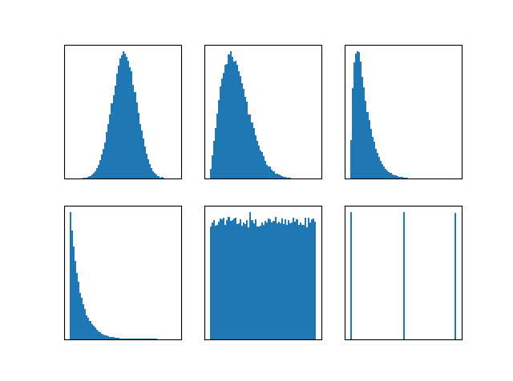
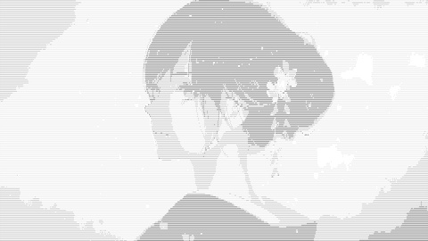

===================================
数字图像处理 OTHERS
===================================

-----------------------------------
数字图像处理 - 噪声
-----------------------------------

一些重要噪声的概率密度函数
===================================

.. image:: http://accu.cc/img/pil/noise/probability_density_of_noises.png

**高斯噪声**: 
:math:`\displaystyle 
p(z) = \frac{1}{\sqrt{2\pi}\sigma}e^{-\frac{(z - \bar z)^2}{2\sigma^2}}` 

其中 :math:`z` 表示灰度值, :math:`\bar{z}` 表示 :math:`z` 的均值, :math:`\sigma` 表示 :math:`z` 的标准差. 
当 :math:`z` 服从高斯分布时, 其值有 68% 落在范围 :math:`[(\bar{z} - \sigma), (\bar{z} + \sigma)]` 内, 有 95% 落在范围 :math:`[(\bar{z} - 2\sigma), (\bar{z} + 2\sigma)]` 内. 

**瑞利噪声**: 
:math:`\displaystyle 
p(z) = 
\begin{cases}
\frac{2}{b}(z-a)e^{-\frac{(z-a)^2 }{b}} \,,&\text{ if } z \ge a \,;\\
0 \,,&\text{ if } z < a
\end{cases}`

概率密度的均值和方差为 :math:`\bar z = a + \sqrt{\frac{\pi b}{4}}`, :math:`\sigma^2 = \frac{b(4-\pi)}{4}`

**伽马 (爱尔兰) 噪声**: 
:math:`\displaystyle 
p(z) = 
\begin{cases}
\frac{a^bz^{b-1}}{(b-1)!}e^{-az} \,,&\text{ if } z \ge a \,;\\
0 \,,&\text{ if } z < a
\end{cases}`

概率密度的均值和方差为 :math:`\bar z = \frac{b}{a}`, :math:`\sigma^2 = \frac{b}{a^2}`

**指数噪声**: 
:math:`\displaystyle 
p(z) = 
\begin{cases}
ae^{-az} \,,&\text{ if } z \ge a \,;\\
0 \,,&\text{ if } z < a
\end{cases}`

概率密度的均值和方差为 :math:`\bar z = \frac{1}{a}`, :math:`\sigma^2 = \frac{1}{a^2}`

**均匀噪声**: 
:math:`\displaystyle 
p(z) = 
\begin{cases}
\frac{1}{b-a} \,,&\text{ if } a \le z \le b \,;\\
0 \,,&\text{ otherwise }
\end{cases}`

概率密度的均值和方差为 :math:`\bar{z} = \frac{a+b}{2}`, :math:`\sigma^2 = \frac{(b-a)^2}{12}`

**脉冲 (椒盐) 噪声**: 
:math:`\displaystyle 
p(z) = 
\begin{cases}
P_a \,,&\text{ if } z = a \,;\\
P_b \,,&\text{ if } z = b \,;\\
1-P_a-P_b \,,& \text{ otherwise }
\end{cases}`

如果 b > a, 则灰度级 b 在图像中将显示一个亮点, 反之, 灰度级 a 在图像中将显示一个暗点. 
若 :math:`P_a` 或 :math:`P_b` 为 0, 则脉冲噪声称为 **单极脉冲**. 
如果 :math:`P_a` 和 :math:`P_b` 两者均不为 0, 尤其是它们近似相等时, 称 **双极脉冲**, 也称为 **椒盐脉冲** (因为图像酷似被随机撒了胡椒颗粒和盐粉颗粒).

使用numpy.random生成指定类型的噪声
===================================

::

    import matplotlib.pyplot as plt
    import numpy as np

    # 高斯噪声: 均值为 0, 标准差为 64
    x1 = np.random.normal(loc=0, scale=64, size=(256, 256))

    # 瑞利噪声: (2 / b) ** 0.5 为 1
    x2 = np.random.rayleigh(scale=64, size=(256, 256))

    # 伽马噪声: (b-1) / a 为 2, 放大 32 倍
    x3 = np.random.gamma(shape=2, scale=32, size=(256, 256))

    # 指数噪声: a = 1/32
    x4 = np.random.exponential(scale=32, size=(256, 256))

    # 均匀噪声
    x5 = np.random.uniform(low=0, high=1.0, size=(256, 256))

    # 脉冲噪声
    x6 = np.random.random_integers(low=0.1, high=2.0, size=(256, 256))

    for i, x in enumerate([x1, x2, x3, x4, x5, x6]):
        ax = plt.subplot(23 * 10 + i + 1)
        ax.hist(x.reshape(x.size), 64, normed=True)
        ax.set_yticks([])
        ax.set_xticks([])
    plt.show()

输出结果: 

.. image:: http://accu.cc/img/pil/noise/hist_of_noises.png

自己生成的结果

使用噪声退化原图
===================================

| 代码大致与 ***数字图像处理-加性高斯白噪声与去噪*** 一致. 
| ref: http://accu.cc/content/pil/agwn/

-----------------------------------
数字图像处理 - 安全色
-----------------------------------

216 安全色
===================================

虽然目前显示器, 显卡提供 24 比特的 RGB 图像的合理的彩色再现, 但今天所用的系统很多仍然局限于 256 种颜色. 颜色的显示与观察者硬件无关是非常重要的, 这种颜色子集称为 **安全色**. 其中最广泛使用的是 216 种安全色.

安全色要求 RGB 三个通道分量只能由 `0x00`, `0x33`, `0x66`, `0x99`, `0xCC`, `0xFF` 构成, 因此总计 :math:`6^3 = 216` 种颜色.

refs: 

- 216 安全色: http://accu.cc/content/pil/safe_color/
- raw markdown: https://github.com/mohanson/accu/blob/master/docs/content/pil/safe_color.md

::

    <svg width="100%" height="1728">
        <rect width="16.66%" height="48" x="0.0%" y="0" fill="#FFFFFF"></rect>
        <rect width="16.66%" height="48" x="16.6667%" y="0" fill="#FFFFCC"></rect>
        <rect width="16.66%" height="48" x="33.3334%" y="0" fill="#FFFF99"></rect>
        <rect width="16.66%" height="48" x="50.000099999999996%" y="0" fill="#FFFF66"></rect>
        <rect width="16.66%" height="48" x="66.6668%" y="0" fill="#FFFF33"></rect>
        <rect width="16.66%" height="48" x="83.33349999999999%" y="0" fill="#FFFF00"></rect>
        <rect width="16.66%" height="48" x="0.0%" y="48" fill="#FFCCFF"></rect>
        <rect width="16.66%" height="48" x="16.6667%" y="48" fill="#FFCCCC"></rect>
        <rect width="16.66%" height="48" x="33.3334%" y="48" fill="#FFCC99"></rect>
        <rect width="16.66%" height="48" x="50.000099999999996%" y="48" fill="#FFCC66"></rect>
        <rect width="16.66%" height="48" x="66.6668%" y="48" fill="#FFCC33"></rect>
        <rect width="16.66%" height="48" x="83.33349999999999%" y="48" fill="#FFCC00"></rect>
        <rect width="16.66%" height="48" x="0.0%" y="96" fill="#FF99FF"></rect>
        <rect width="16.66%" height="48" x="16.6667%" y="96" fill="#FF99CC"></rect>
        <rect width="16.66%" height="48" x="33.3334%" y="96" fill="#FF9999"></rect>
        <rect width="16.66%" height="48" x="50.000099999999996%" y="96" fill="#FF9966"></rect>
        <rect width="16.66%" height="48" x="66.6668%" y="96" fill="#FF9933"></rect>
        <rect width="16.66%" height="48" x="83.33349999999999%" y="96" fill="#FF9900"></rect>
        <rect width="16.66%" height="48" x="0.0%" y="144" fill="#FF66FF"></rect>
        <rect width="16.66%" height="48" x="16.6667%" y="144" fill="#FF66CC"></rect>
        <rect width="16.66%" height="48" x="33.3334%" y="144" fill="#FF6699"></rect>
        <rect width="16.66%" height="48" x="50.000099999999996%" y="144" fill="#FF6666"></rect>
        <rect width="16.66%" height="48" x="66.6668%" y="144" fill="#FF6633"></rect>
        <rect width="16.66%" height="48" x="83.33349999999999%" y="144" fill="#FF6600"></rect>
        <rect width="16.66%" height="48" x="0.0%" y="192" fill="#FF33FF"></rect>
        <rect width="16.66%" height="48" x="16.6667%" y="192" fill="#FF33CC"></rect>
        <rect width="16.66%" height="48" x="33.3334%" y="192" fill="#FF3399"></rect>
        <rect width="16.66%" height="48" x="50.000099999999996%" y="192" fill="#FF3366"></rect>
        <rect width="16.66%" height="48" x="66.6668%" y="192" fill="#FF3333"></rect>
        <rect width="16.66%" height="48" x="83.33349999999999%" y="192" fill="#FF3300"></rect>
        <rect width="16.66%" height="48" x="0.0%" y="240" fill="#FF00FF"></rect>
        <rect width="16.66%" height="48" x="16.6667%" y="240" fill="#FF00CC"></rect>
        <rect width="16.66%" height="48" x="33.3334%" y="240" fill="#FF0099"></rect>
        <rect width="16.66%" height="48" x="50.000099999999996%" y="240" fill="#FF0066"></rect>
        <rect width="16.66%" height="48" x="66.6668%" y="240" fill="#FF0033"></rect>
        <rect width="16.66%" height="48" x="83.33349999999999%" y="240" fill="#FF0000"></rect>
        <rect width="16.66%" height="48" x="0.0%" y="288" fill="#CCFFFF"></rect>
        <rect width="16.66%" height="48" x="16.6667%" y="288" fill="#CCFFCC"></rect>
        <rect width="16.66%" height="48" x="33.3334%" y="288" fill="#CCFF99"></rect>
        <rect width="16.66%" height="48" x="50.000099999999996%" y="288" fill="#CCFF66"></rect>
        <rect width="16.66%" height="48" x="66.6668%" y="288" fill="#CCFF33"></rect>
        <rect width="16.66%" height="48" x="83.33349999999999%" y="288" fill="#CCFF00"></rect>
        <rect width="16.66%" height="48" x="0.0%" y="336" fill="#CCCCFF"></rect>
        <rect width="16.66%" height="48" x="16.6667%" y="336" fill="#CCCCCC"></rect>
        <rect width="16.66%" height="48" x="33.3334%" y="336" fill="#CCCC99"></rect>
        <rect width="16.66%" height="48" x="50.000099999999996%" y="336" fill="#CCCC66"></rect>
        <rect width="16.66%" height="48" x="66.6668%" y="336" fill="#CCCC33"></rect>
        <rect width="16.66%" height="48" x="83.33349999999999%" y="336" fill="#CCCC00"></rect>
        <rect width="16.66%" height="48" x="0.0%" y="384" fill="#CC99FF"></rect>
        <rect width="16.66%" height="48" x="16.6667%" y="384" fill="#CC99CC"></rect>
        <rect width="16.66%" height="48" x="33.3334%" y="384" fill="#CC9999"></rect>
        <rect width="16.66%" height="48" x="50.000099999999996%" y="384" fill="#CC9966"></rect>
        <rect width="16.66%" height="48" x="66.6668%" y="384" fill="#CC9933"></rect>
        <rect width="16.66%" height="48" x="83.33349999999999%" y="384" fill="#CC9900"></rect>
        <rect width="16.66%" height="48" x="0.0%" y="432" fill="#CC66FF"></rect>
        <rect width="16.66%" height="48" x="16.6667%" y="432" fill="#CC66CC"></rect>
        <rect width="16.66%" height="48" x="33.3334%" y="432" fill="#CC6699"></rect>
        <rect width="16.66%" height="48" x="50.000099999999996%" y="432" fill="#CC6666"></rect>
        <rect width="16.66%" height="48" x="66.6668%" y="432" fill="#CC6633"></rect>
        <rect width="16.66%" height="48" x="83.33349999999999%" y="432" fill="#CC6600"></rect>
        <rect width="16.66%" height="48" x="0.0%" y="480" fill="#CC33FF"></rect>
        <rect width="16.66%" height="48" x="16.6667%" y="480" fill="#CC33CC"></rect>
        <rect width="16.66%" height="48" x="33.3334%" y="480" fill="#CC3399"></rect>
        <rect width="16.66%" height="48" x="50.000099999999996%" y="480" fill="#CC3366"></rect>
        <rect width="16.66%" height="48" x="66.6668%" y="480" fill="#CC3333"></rect>
        <rect width="16.66%" height="48" x="83.33349999999999%" y="480" fill="#CC3300"></rect>
        <rect width="16.66%" height="48" x="0.0%" y="528" fill="#CC00FF"></rect>
        <rect width="16.66%" height="48" x="16.6667%" y="528" fill="#CC00CC"></rect>
        <rect width="16.66%" height="48" x="33.3334%" y="528" fill="#CC0099"></rect>
        <rect width="16.66%" height="48" x="50.000099999999996%" y="528" fill="#CC0066"></rect>
        <rect width="16.66%" height="48" x="66.6668%" y="528" fill="#CC0033"></rect>
        <rect width="16.66%" height="48" x="83.33349999999999%" y="528" fill="#CC0000"></rect>
        <rect width="16.66%" height="48" x="0.0%" y="576" fill="#99FFFF"></rect>
        <rect width="16.66%" height="48" x="16.6667%" y="576" fill="#99FFCC"></rect>
        <rect width="16.66%" height="48" x="33.3334%" y="576" fill="#99FF99"></rect>
        <rect width="16.66%" height="48" x="50.000099999999996%" y="576" fill="#99FF66"></rect>
        <rect width="16.66%" height="48" x="66.6668%" y="576" fill="#99FF33"></rect>
        <rect width="16.66%" height="48" x="83.33349999999999%" y="576" fill="#99FF00"></rect>
        <rect width="16.66%" height="48" x="0.0%" y="624" fill="#99CCFF"></rect>
        <rect width="16.66%" height="48" x="16.6667%" y="624" fill="#99CCCC"></rect>
        <rect width="16.66%" height="48" x="33.3334%" y="624" fill="#99CC99"></rect>
        <rect width="16.66%" height="48" x="50.000099999999996%" y="624" fill="#99CC66"></rect>
        <rect width="16.66%" height="48" x="66.6668%" y="624" fill="#99CC33"></rect>
        <rect width="16.66%" height="48" x="83.33349999999999%" y="624" fill="#99CC00"></rect>
        <rect width="16.66%" height="48" x="0.0%" y="672" fill="#9999FF"></rect>
        <rect width="16.66%" height="48" x="16.6667%" y="672" fill="#9999CC"></rect>
        <rect width="16.66%" height="48" x="33.3334%" y="672" fill="#999999"></rect>
        <rect width="16.66%" height="48" x="50.000099999999996%" y="672" fill="#999966"></rect>
        <rect width="16.66%" height="48" x="66.6668%" y="672" fill="#999933"></rect>
        <rect width="16.66%" height="48" x="83.33349999999999%" y="672" fill="#999900"></rect>
        <rect width="16.66%" height="48" x="0.0%" y="720" fill="#9966FF"></rect>
        <rect width="16.66%" height="48" x="16.6667%" y="720" fill="#9966CC"></rect>
        <rect width="16.66%" height="48" x="33.3334%" y="720" fill="#996699"></rect>
        <rect width="16.66%" height="48" x="50.000099999999996%" y="720" fill="#996666"></rect>
        <rect width="16.66%" height="48" x="66.6668%" y="720" fill="#996633"></rect>
        <rect width="16.66%" height="48" x="83.33349999999999%" y="720" fill="#996600"></rect>
        <rect width="16.66%" height="48" x="0.0%" y="768" fill="#9933FF"></rect>
        <rect width="16.66%" height="48" x="16.6667%" y="768" fill="#9933CC"></rect>
        <rect width="16.66%" height="48" x="33.3334%" y="768" fill="#993399"></rect>
        <rect width="16.66%" height="48" x="50.000099999999996%" y="768" fill="#993366"></rect>
        <rect width="16.66%" height="48" x="66.6668%" y="768" fill="#993333"></rect>
        <rect width="16.66%" height="48" x="83.33349999999999%" y="768" fill="#993300"></rect>
        <rect width="16.66%" height="48" x="0.0%" y="816" fill="#9900FF"></rect>
        <rect width="16.66%" height="48" x="16.6667%" y="816" fill="#9900CC"></rect>
        <rect width="16.66%" height="48" x="33.3334%" y="816" fill="#990099"></rect>
        <rect width="16.66%" height="48" x="50.000099999999996%" y="816" fill="#990066"></rect>
        <rect width="16.66%" height="48" x="66.6668%" y="816" fill="#990033"></rect>
        <rect width="16.66%" height="48" x="83.33349999999999%" y="816" fill="#990000"></rect>
        <rect width="16.66%" height="48" x="0.0%" y="864" fill="#66FFFF"></rect>
        <rect width="16.66%" height="48" x="16.6667%" y="864" fill="#66FFCC"></rect>
        <rect width="16.66%" height="48" x="33.3334%" y="864" fill="#66FF99"></rect>
        <rect width="16.66%" height="48" x="50.000099999999996%" y="864" fill="#66FF66"></rect>
        <rect width="16.66%" height="48" x="66.6668%" y="864" fill="#66FF33"></rect>
        <rect width="16.66%" height="48" x="83.33349999999999%" y="864" fill="#66FF00"></rect>
        <rect width="16.66%" height="48" x="0.0%" y="912" fill="#66CCFF"></rect>
        <rect width="16.66%" height="48" x="16.6667%" y="912" fill="#66CCCC"></rect>
        <rect width="16.66%" height="48" x="33.3334%" y="912" fill="#66CC99"></rect>
        <rect width="16.66%" height="48" x="50.000099999999996%" y="912" fill="#66CC66"></rect>
        <rect width="16.66%" height="48" x="66.6668%" y="912" fill="#66CC33"></rect>
        <rect width="16.66%" height="48" x="83.33349999999999%" y="912" fill="#66CC00"></rect>
        <rect width="16.66%" height="48" x="0.0%" y="960" fill="#6699FF"></rect>
        <rect width="16.66%" height="48" x="16.6667%" y="960" fill="#6699CC"></rect>
        <rect width="16.66%" height="48" x="33.3334%" y="960" fill="#669999"></rect>
        <rect width="16.66%" height="48" x="50.000099999999996%" y="960" fill="#669966"></rect>
        <rect width="16.66%" height="48" x="66.6668%" y="960" fill="#669933"></rect>
        <rect width="16.66%" height="48" x="83.33349999999999%" y="960" fill="#669900"></rect>
        <rect width="16.66%" height="48" x="0.0%" y="1008" fill="#6666FF"></rect>
        <rect width="16.66%" height="48" x="16.6667%" y="1008" fill="#6666CC"></rect>
        <rect width="16.66%" height="48" x="33.3334%" y="1008" fill="#666699"></rect>
        <rect width="16.66%" height="48" x="50.000099999999996%" y="1008" fill="#666666"></rect>
        <rect width="16.66%" height="48" x="66.6668%" y="1008" fill="#666633"></rect>
        <rect width="16.66%" height="48" x="83.33349999999999%" y="1008" fill="#666600"></rect>
        <rect width="16.66%" height="48" x="0.0%" y="1056" fill="#6633FF"></rect>
        <rect width="16.66%" height="48" x="16.6667%" y="1056" fill="#6633CC"></rect>
        <rect width="16.66%" height="48" x="33.3334%" y="1056" fill="#663399"></rect>
        <rect width="16.66%" height="48" x="50.000099999999996%" y="1056" fill="#663366"></rect>
        <rect width="16.66%" height="48" x="66.6668%" y="1056" fill="#663333"></rect>
        <rect width="16.66%" height="48" x="83.33349999999999%" y="1056" fill="#663300"></rect>
        <rect width="16.66%" height="48" x="0.0%" y="1104" fill="#6600FF"></rect>
        <rect width="16.66%" height="48" x="16.6667%" y="1104" fill="#6600CC"></rect>
        <rect width="16.66%" height="48" x="33.3334%" y="1104" fill="#660099"></rect>
        <rect width="16.66%" height="48" x="50.000099999999996%" y="1104" fill="#660066"></rect>
        <rect width="16.66%" height="48" x="66.6668%" y="1104" fill="#660033"></rect>
        <rect width="16.66%" height="48" x="83.33349999999999%" y="1104" fill="#660000"></rect>
        <rect width="16.66%" height="48" x="0.0%" y="1152" fill="#33FFFF"></rect>
        <rect width="16.66%" height="48" x="16.6667%" y="1152" fill="#33FFCC"></rect>
        <rect width="16.66%" height="48" x="33.3334%" y="1152" fill="#33FF99"></rect>
        <rect width="16.66%" height="48" x="50.000099999999996%" y="1152" fill="#33FF66"></rect>
        <rect width="16.66%" height="48" x="66.6668%" y="1152" fill="#33FF33"></rect>
        <rect width="16.66%" height="48" x="83.33349999999999%" y="1152" fill="#33FF00"></rect>
        <rect width="16.66%" height="48" x="0.0%" y="1200" fill="#33CCFF"></rect>
        <rect width="16.66%" height="48" x="16.6667%" y="1200" fill="#33CCCC"></rect>
        <rect width="16.66%" height="48" x="33.3334%" y="1200" fill="#33CC99"></rect>
        <rect width="16.66%" height="48" x="50.000099999999996%" y="1200" fill="#33CC66"></rect>
        <rect width="16.66%" height="48" x="66.6668%" y="1200" fill="#33CC33"></rect>
        <rect width="16.66%" height="48" x="83.33349999999999%" y="1200" fill="#33CC00"></rect>
        <rect width="16.66%" height="48" x="0.0%" y="1248" fill="#3399FF"></rect>
        <rect width="16.66%" height="48" x="16.6667%" y="1248" fill="#3399CC"></rect>
        <rect width="16.66%" height="48" x="33.3334%" y="1248" fill="#339999"></rect>
        <rect width="16.66%" height="48" x="50.000099999999996%" y="1248" fill="#339966"></rect>
        <rect width="16.66%" height="48" x="66.6668%" y="1248" fill="#339933"></rect>
        <rect width="16.66%" height="48" x="83.33349999999999%" y="1248" fill="#339900"></rect>
        <rect width="16.66%" height="48" x="0.0%" y="1296" fill="#3366FF"></rect>
        <rect width="16.66%" height="48" x="16.6667%" y="1296" fill="#3366CC"></rect>
        <rect width="16.66%" height="48" x="33.3334%" y="1296" fill="#336699"></rect>
        <rect width="16.66%" height="48" x="50.000099999999996%" y="1296" fill="#336666"></rect>
        <rect width="16.66%" height="48" x="66.6668%" y="1296" fill="#336633"></rect>
        <rect width="16.66%" height="48" x="83.33349999999999%" y="1296" fill="#336600"></rect>
        <rect width="16.66%" height="48" x="0.0%" y="1344" fill="#3333FF"></rect>
        <rect width="16.66%" height="48" x="16.6667%" y="1344" fill="#3333CC"></rect>
        <rect width="16.66%" height="48" x="33.3334%" y="1344" fill="#333399"></rect>
        <rect width="16.66%" height="48" x="50.000099999999996%" y="1344" fill="#333366"></rect>
        <rect width="16.66%" height="48" x="66.6668%" y="1344" fill="#333333"></rect>
        <rect width="16.66%" height="48" x="83.33349999999999%" y="1344" fill="#333300"></rect>
        <rect width="16.66%" height="48" x="0.0%" y="1392" fill="#3300FF"></rect>
        <rect width="16.66%" height="48" x="16.6667%" y="1392" fill="#3300CC"></rect>
        <rect width="16.66%" height="48" x="33.3334%" y="1392" fill="#330099"></rect>
        <rect width="16.66%" height="48" x="50.000099999999996%" y="1392" fill="#330066"></rect>
        <rect width="16.66%" height="48" x="66.6668%" y="1392" fill="#330033"></rect>
        <rect width="16.66%" height="48" x="83.33349999999999%" y="1392" fill="#330000"></rect>
        <rect width="16.66%" height="48" x="0.0%" y="1440" fill="#00FFFF"></rect>
        <rect width="16.66%" height="48" x="16.6667%" y="1440" fill="#00FFCC"></rect>
        <rect width="16.66%" height="48" x="33.3334%" y="1440" fill="#00FF99"></rect>
        <rect width="16.66%" height="48" x="50.000099999999996%" y="1440" fill="#00FF66"></rect>
        <rect width="16.66%" height="48" x="66.6668%" y="1440" fill="#00FF33"></rect>
        <rect width="16.66%" height="48" x="83.33349999999999%" y="1440" fill="#00FF00"></rect>
        <rect width="16.66%" height="48" x="0.0%" y="1488" fill="#00CCFF"></rect>
        <rect width="16.66%" height="48" x="16.6667%" y="1488" fill="#00CCCC"></rect>
        <rect width="16.66%" height="48" x="33.3334%" y="1488" fill="#00CC99"></rect>
        <rect width="16.66%" height="48" x="50.000099999999996%" y="1488" fill="#00CC66"></rect>
        <rect width="16.66%" height="48" x="66.6668%" y="1488" fill="#00CC33"></rect>
        <rect width="16.66%" height="48" x="83.33349999999999%" y="1488" fill="#00CC00"></rect>
        <rect width="16.66%" height="48" x="0.0%" y="1536" fill="#0099FF"></rect>
        <rect width="16.66%" height="48" x="16.6667%" y="1536" fill="#0099CC"></rect>
        <rect width="16.66%" height="48" x="33.3334%" y="1536" fill="#009999"></rect>
        <rect width="16.66%" height="48" x="50.000099999999996%" y="1536" fill="#009966"></rect>
        <rect width="16.66%" height="48" x="66.6668%" y="1536" fill="#009933"></rect>
        <rect width="16.66%" height="48" x="83.33349999999999%" y="1536" fill="#009900"></rect>
        <rect width="16.66%" height="48" x="0.0%" y="1584" fill="#0066FF"></rect>
        <rect width="16.66%" height="48" x="16.6667%" y="1584" fill="#0066CC"></rect>
        <rect width="16.66%" height="48" x="33.3334%" y="1584" fill="#006699"></rect>
        <rect width="16.66%" height="48" x="50.000099999999996%" y="1584" fill="#006666"></rect>
        <rect width="16.66%" height="48" x="66.6668%" y="1584" fill="#006633"></rect>
        <rect width="16.66%" height="48" x="83.33349999999999%" y="1584" fill="#006600"></rect>
        <rect width="16.66%" height="48" x="0.0%" y="1632" fill="#0033FF"></rect>
        <rect width="16.66%" height="48" x="16.6667%" y="1632" fill="#0033CC"></rect>
        <rect width="16.66%" height="48" x="33.3334%" y="1632" fill="#003399"></rect>
        <rect width="16.66%" height="48" x="50.000099999999996%" y="1632" fill="#003366"></rect>
        <rect width="16.66%" height="48" x="66.6668%" y="1632" fill="#003333"></rect>
        <rect width="16.66%" height="48" x="83.33349999999999%" y="1632" fill="#003300"></rect>
        <rect width="16.66%" height="48" x="0.0%" y="1680" fill="#0000FF"></rect>
        <rect width="16.66%" height="48" x="16.6667%" y="1680" fill="#0000CC"></rect>
        <rect width="16.66%" height="48" x="33.3334%" y="1680" fill="#000099"></rect>
        <rect width="16.66%" height="48" x="50.000099999999996%" y="1680" fill="#000066"></rect>
        <rect width="16.66%" height="48" x="66.6668%" y="1680" fill="#000033"></rect>
        <rect width="16.66%" height="48" x="83.33349999999999%" y="1680" fill="#000000"></rect>
    </svg>

-----------------------------------
数字图像处理 - 马卡龙色
-----------------------------------

马卡龙色
===================================

.. image:: http://accu.cc/img/pil/macaron_color/macaron_color.jpg

让人看了非常舒服的 10 种颜色, 据说来自马卡龙. 收藏记录一下以备不时之需, 这十种颜色分别是:

- ``#19CAAD`` #19CAAD
- ``#8CC7B5`` #8CC7B5
- ``#A0EEE1`` #A0EEE1
- ``#BEE7E9`` #BEE7E9
- ``#BEEDC7`` #BEEDC7
- ``#D6D5B7`` #D6D5B7
- ``#D1BA74`` #D1BA74
- ``#E6CEAC`` #E6CEAC
- ``#ECAD9E`` #ECAD9E
- ``#F4606C`` #F4606C

refs: 

- macaron color: http://accu.cc/content/pil/macaron_color/
- raw markdown: https://github.com/mohanson/accu/blob/master/docs/content/pil/macaron_color.md

::

    - <code style="color: #19CAAD; background-color: #19CAAD">#19CAAD</code> `#19CAAD`
    - <code style="color: #8CC7B5; background-color: #8CC7B5">#8CC7B5</code> `#8CC7B5`
    - <code style="color: #A0EEE1; background-color: #A0EEE1">#A0EEE1</code> `#A0EEE1`
    - <code style="color: #BEE7E9; background-color: #BEE7E9">#BEE7E9</code> `#BEE7E9`
    - <code style="color: #BEEDC7; background-color: #BEEDC7">#BEEDC7</code> `#BEEDC7`
    - <code style="color: #D6D5B7; background-color: #D6D5B7">#D6D5B7</code> `#D6D5B7`
    - <code style="color: #D1BA74; background-color: #D1BA74">#D1BA74</code> `#D1BA74`
    - <code style="color: #E6CEAC; background-color: #E6CEAC">#E6CEAC</code> `#E6CEAC`
    - <code style="color: #ECAD9E; background-color: #ECAD9E">#ECAD9E</code> `#ECAD9E`
    - <code style="color: #F4606C; background-color: #F4606C">#F4606C</code> `#F4606C`

-----------------------------------
数字图像处理 - 补色和反色
-----------------------------------

补色
===================================

::

    import numpy as np
    import PIL.Image
    import scipy.misc

    im = PIL.Image.open('/DSP/jp.jpg')
    im = im.convert('RGB')
    im_mat = np.asarray(im)

    im_converted_mat = np.zeros_like(im_mat, dtype=np.uint8)
    for x in range(im_mat.shape[0]):
        for y in range(im_mat.shape[1]):
            # 补色的公式是 max(r, g, b) + min(r, g, b) - [r, g, b]
            maxrgb = im_mat[x][y].max()
            minrgb = im_mat[x][y].min()
            im_converted_mat[x][y] = (int(maxrgb) + int(minrgb)) * np.ones(3) - im_mat[x][y]

    im_converted = PIL.Image.fromarray(im_converted_mat)
    im_converted.show()

.. image:: http://accu.cc/img/pil/complementary_and_invert_color/complementary_color.jpg

反色
===================================

::

    import numpy as np
    import PIL.Image
    import scipy.misc

    im = PIL.Image.open('/DSP/jp.jpg')
    im = im.convert('RGB')
    im_mat = np.asarray(im)
    # 反色的公式是 [255, 255, 255] - [r, g, b]
    im_converted_mat = np.ones_like(im_mat) * 255 - im_mat
    im_converted = PIL.Image.fromarray(im_converted_mat)
    im_converted.show()

.. image:: http://accu.cc/img/pil/complementary_and_invert_color/invert_color.jpg

-----------------------------------
数字图像处理 - 水印
-----------------------------------

简单可见水印
===================================

简单可见水印可由如下公式生成 
:math:`f_w = (1 - \alpha)f + \alpha w`

其中 :math:`\alpha` 控制水印和衬底的相对可见性, :math:`f` 为衬底, :math:`w` 为水印图片. 
特别的, 当 :math:`w` 为 RGBA 模式时, 参与计算的 :math:`\alpha` 需要乘以水印的 A 通道与 255 的比值.

::

    import PIL.Image
    import scipy.misc

    im = scipy.misc.imread('/DSP/jp.jpg', mode='RGBA')
    im_water = scipy.misc.imread('/DSP/watermark.jpg', mode='RGBA')

    for x in range(im_water.shape[0]):
        for y in range(im_water.shape[1]):
            a = 0.3 * im_water[x][y][-1] / 255
            im[x][y][0:3] = (1 - a) * im[x][y][0:3] + a * im_water[x][y][0:3]

    PIL.Image.fromarray(im).show()

以下图片是上述代码使用 :math:`\alpha = 0.3` 的运行结果, 其中左上角为水印图片.

.. image:: http://accu.cc/img/pil/watermark/sample01.png

.. admonition:: 执行错误

    **Errors**:

    - scipy.misc doesn't have `imread`
    - RGBA cannot be saved as jpg
      (**KeyError: 'RGBA'**)

    ::

        import imageio
        im = imageio.imread('./jp.jpg', pilmode='RGBA')
        im_water = imageio.imread('./watermark.png', pilmode='RGBA')

        im_mat = PIL.Image.fromarray(im)
        im_mat.show()
        im_mat = im_mat.convert('RGB')
        im_mat.save('./3other_watermark.jpg', quality=95)

    | **refs**:
    | https://github.com/python-pillow/Pillow/issues/2609
    | https://stackoverflow.com/questions/48248405/cannot-write-mode-rgba-as-jpeg/48248432

    .. image:: ../../../DSP/3other_watermark.jpg

LSB不可见水印
===================================

ref: http://accu.cc/content/pil/bit/

在 ***数字图像处理-位图切割*** 一文中, 已经知晓了 8 比特位图像的最低阶比特对人眼感知几乎没有影响, 因此, 可以将水印图像的高阶比特位"插入"在衬底的低阶比特位中. 

:math:`f_w = 4\Big(\frac{f}{4}\Big) + \frac{w}{64}`

上述公式将原图使用无符号整数除以 4 并乘以 4, 来置最低两个比特位为 0, 并用 64 除 :math:`w`, 将 :math:`w` 的两个最高比特位移到衬底的最低比特位上.

::

    import PIL.Image
    import numpy as np
    import scipy.misc

    im = scipy.misc.imread('/img/jp.jpg', mode='RGBA')
    im_water = scipy.misc.imread('/img/water.jpg', mode='RGBA')

    # LSB 水印的第一步是滤除衬底最后 2 个低阶比特位
    im = im // 4 * 4

    for x in range(im_water.shape[0]):
        for y in range(im_water.shape[1]):
            im[x][y] += im_water[x][y] // 64

    # 显示加水印后的图像
    PIL.Image.fromarray(im.astype(np.uint8)).show()

    im = im % 4 / 3 * 255
    # 显示提取的水印图像
    PIL.Image.fromarray(im.astype(np.uint8)).show()

显示加水印后的图像

.. image:: http://accu.cc/img/pil/watermark/sample02.png

显示提取的水印图像

.. image:: http://accu.cc/img/pil/watermark/sample03.png

要说明的是, LSB 水印非常脆弱, 诸如裁剪, 旋转, 缩放, 图像压缩等操作可以轻易破坏该水印.

===================================
数字图像处理 - 缩放
===================================

-----------------------------------
缩放 - 最近邻插值法
-----------------------------------

最近邻插值法
===================================

在计算机图形学中, 图像缩放指的是通过增加或去掉像素来改变图片的尺寸. 由于要在效率和图像质量比如平滑度和清晰度之间做折衷, 图像缩放并不是个平庸/平凡的过程. 当图像尺寸增大的时候, 组成图像的像素也越来越大, 图像看上去就变"柔和"了. 而缩小图像的时候, 图像就变得平滑和清晰了. 本文介绍最简单的 **最近邻插值法 (Nearest-neighbor interpolation)**.

原理
===================================

近邻取样插值法是将目标图像各点的像素值设为原图像中与其最近的点. 假设原图的大小为 :math:`(w_0, h_0)`, 坐标以 :math:`(x_0, y_0)` 描述, 缩放后的图像大小为 :math:`(w_1, h_1)`, 坐标以 :math:`(x_1, y_1)` 描述, 则有

:math:`\displaystyle
\begin{cases}
\frac{x_1 + 1}{x_0 + 1} = \frac{w_1}{w_0} \\
\frac{y_1 + 1}{y_0 + 1} = \frac{h_1}{h_0}
\end{cases}`

代码实现
===================================

::

    import PIL.Image

    im = PIL.Image.open('/DSP/jp.jpg')
    im_resized = PIL.Image.new(im.mode, (480, 270))
    for r in range(im_resized.size[1]):
        for c in range(im_resized.size[0]):
            rr = round((r+1) / im_resized.size[1] * im.size[1]) - 1
            cc = round((c+1) / im_resized.size[0] * im.size[0]) - 1
            im_resized.putpixel((c, r), im.getpixel((cc, rr)))
    im_resized.show()

-----------------------------------
缩放 - 最近邻插值法的幽灵事件
-----------------------------------

近邻取样插值法的幽灵事件
===================================

**当通过近邻取样插值法对图片进行缩放的时候, 目标图像的每个像素都来源于原图像的对应位置像素.** 
这可能会造成意想不到的后果. 

考虑如下图片, 该图像似乎并没有什么特别, 但对该图像进行缩放时:

.. image:: http://accu.cc/img/pil/resize_nearst_ghost/jp_ghost.bmp

::

    import PIL.Image

    im = PIL.Image.open('/DSP/jp_ghost.bmp')
    im = im.resize((im.size[0] // 2, im.size[1] // 2), PIL.Image.NEAREST)
    im.show()

长宽均缩放 1/2 后的图片如下:

.. image:: http://accu.cc/img/pil/resize_nearst_ghost/jp_ghost_resized.jpg

原图变成了一张颜色为 (99, 97, 101) 的纯色图片.

分析
===================================

在使用近邻取样插值法缩放的时候, 原图中特定的像素点将组合成新的图片. 因此只需要控制原图中的特定位置的像素点, 就能控制缩放后生成的图像.

将原图放大, 观察到如下结构, 可以看到大量规则排列的 (99, 97, 101) 像素点覆盖了整个原图. 当缩放至 1/2 时, 这些像素点被取出并组合成了新的图像. 其中 (99, 97, 101) 是原图的 *图像均值*.

.. image:: http://accu.cc/img/pil/resize_nearst_ghost/jp_ghost_stats.jpg

ref: 图像均值 http://accu.cc/content/pil/mean/

注: 生成幽灵图片的代码如下:

::

    import PIL.Image
    import PIL.ImageStat

    im = PIL.Image.open('/DSP/jp.jpg')
    mean = PIL.ImageStat.Stat(im).mean
    mean = tuple(int(e) for e in mean)

    for x in range(im.size[0] // 2):
        for y in range(im.size[1] // 2):
            im.putpixel((2 * x + 1, 2 * y + 1), mean)

    im.show()

-----------------------------------
缩放 - 双线性插值法
-----------------------------------

双线性算法
===================================

双线性插值法与最近邻插值法类似, 不同点是取原图像中距离目标像素点最近的 4 个点, 并对这 4 个点与其对应权值的乘积求和, 获得最终像素值.

如下图:

.. image:: http://accu.cc/img/pil/resize_bilinear/bilinear_interpolation.jpg

目标点为 :math:`P`, 距离 :math:`P` 最近的四个点为 :math:`Q_{11}, Q_{12}, Q_{21}, Q_{22}`, 与 :math:`P` 围成的面积为 :math:`S_{11}, S_{12}, S_{21}, S_{22}`, 分别以 **黄, 红, 青, 橙** 标出. 
由于 :math:`S_{11} + S_{12} + S_{21} + S_{22} = 1`, 因此最终求得的 :math:`P` 的像素值为

:math:`P = Q_{11} \times S_{22} + Q_{12} \times S_{21} + Q_{21} \times S_{12} + Q_{22} \times S_{11}`

代码实现
===================================

为了方便计算, 下述程序将图像转换为矩阵进行操作.

::

    import numpy as np
    import PIL.Image
    import scipy.misc

    im = PIL.Image.open('/DSP/jp.jpg')
    im_mat = np.asarray(im)
    im_mat_resized = np.empty((270, 480, im_mat.shape[2]), dtype=np.uint8)

    for r in range(im_mat_resized.shape[0]):
        for c in range(im_mat_resized.shape[1]):
            rr = (r + 1) / im_mat_resized.shape[0] * im_mat.shape[0] - 1
            cc = (c + 1) / im_mat_resized.shape[1] * im_mat.shape[1] - 1

            rr_int = int(rr)
            cc_int = int(cc)

            if rr == rr_int and cc == cc_int:
                p = im_mat[rr_int][cc_int]
            elif rr == rr_int:
                p = im_mat[rr_int][cc_int] * (cc_int + 1 - cc) + im_mat[rr_int][cc_int + 1] * (cc - cc_int)
            elif cc == cc_int:
                p = im_mat[rr_int][cc_int] * (rr_int + 1 - rr) + im_mat[rr_int + 1][cc_int] * (rr - rr_int)
            else:
                p11 = (rr_int, cc_int)
                p12 = (rr_int, cc_int + 1)
                p21 = (rr_int + 1, cc_int)
                p22 = (rr_int + 1, cc_int + 1)

                dr1 = rr - rr_int
                dr2 = rr_int + 1 - rr
                dc1 = cc - cc_int
                dc2 = cc_int + 1 - cc

                w11 = dr2 * dc2
                w12 = dr2 * dc1
                w21 = dr1 * dc2
                w22 = dr1 * dc1

                p = im_mat[p11[0]][p11[1]] * w11 + im_mat[p21[0]][p21[1]] * w12 + \
                    im_mat[p12[0]][p12[1]] * w21 + im_mat[p22[0]][p22[1]] * w22

            im_mat_resized[r][c] = p

    im_resized = PIL.Image.fromarray(im_mat_resized)
    im_resized.show()

优化
===================================

详见 https://en.wikipedia.org/wiki/Bilinear_interpolation

**refs:**

- 图像处理值双线性插值法 https://blog.csdn.net/qq_37577735/article/details/80041586
- 双线性插值 百度百科 https://baike.baidu.com/item/%E5%8F%8C%E7%BA%BF%E6%80%A7%E6%8F%92%E5%80%BC/11055945?fr=aladdin

.. admonition:: 线性插值

    **单线性插值法**

    已知数据 :math:`(x_0,y_0)` 与 :math:`(x_1,y_1)`，要计算 :math:`[x_0,x_1]` 区间内某一位置 :math:`x` 在直线上的 :math:`y` 值。

    .. image:: https://img-blog.csdn.net/20180310144742113?watermark/2/text/aHR0cDovL2Jsb2cuY3Nkbi5uZXQvbG92ZXhsc2ZvcmV2ZXI=/font/5a6L5L2T/fontsize/400/fill/I0JBQkFCMA==/dissolve/70

    :math:`\begin{align}
    & \frac{y - y_0}{x - x_0} = \frac{y_1 - y_0}{x_1 - x_0} \\
    y= & \frac{x_1-x}{x_1-x_0} y_0 + \frac{x-x_0}{x_1-x_0} y_1
    \end{align}`

    计算过程：

    :math:`\begin{align}
    y= & \frac{y_1-y_0}{x_1-x_0} x - \frac{y_1-y_0}{x_1-x_0}x_0 + y_0 \\
    =& \frac{y_1-y_0}{x_1-x_0}x - \frac{ y_1x_0 - y_0x_0 + x_1y_0 - x_0y_0 }{x_1-x_0} \\
    =& \frac{y_1-y_0}{x_1-x_0}x - \frac{x_0y_1 + x_1y_0 -2 x_0y_0}{x_1-x_0}
    \end{align}`

    :math:`\begin{align}
    y =& \bigg(1-\frac{x-x_0}{x_1-x_0}\bigg)y_0 + \frac{x-x_0}{x_1-x_0}y_1 \\
    =& \frac{x_1-x}{x_1-x_0}y_0 + \frac{x-x_0}{x_1-x_0}y_1
    \end{align}`

    **双线性插值法**

    在数学上是有两个变量的插值函数的线性插值扩展，其核心思想是在两个方向上分别进行一次线性插值。

    .. image:: https://img-blog.csdn.net/20180310145919203?watermark/2/text/aHR0cDovL2Jsb2cuY3Nkbi5uZXQvbG92ZXhsc2ZvcmV2ZXI=/font/5a6L5L2T/fontsize/400/fill/I0JBQkFCMA==/dissolve/70

    欲求未知函数 :math:`f` 在点 :math:`P=(x,y)` 的值，假设已知函数在 :math:`Q_{11}=(x_1,y_1), Q_{12}=(x_1,y_2), Q_{21}=(x_2,y_1), Q_{22}=(x_2,y_2)` 四个点上的值。
    最常见的情况，f 就是一个像素点的像素值。

    首先在 x 方向上进行线性插值，可得

    :math:`\begin{align}
    f(R_1) \approx & \frac{x_2-x}{x_2-x_1}f(Q_{11}) + \frac{x-x_1}{x_2-x_1}f(Q_{21}) \;\text{ where } R_1=(x,y_1) \\
    f(R_2) \approx & \frac{x_2-x}{x_2-x_1}f(Q_{12}) + \frac{x-x_1}{x_2-x_1}f(Q_{22}) \;\text{ where } R_2=(x,y_2)
    \end{align}`

    然后在 y 方向上进行线性插值，可得

    :math:`\begin{align}
    f(P) \approx \frac{y_2-y}{y_2-y_1}f(R_1) + \frac{y-y_1}{y_2-y_1}f(R_2)
    \end{align}`

    综合起来就是双线性内插的最终结果，即

    :math:`\begin{align}
    f(x,y) =& 
    \quad\, \frac{(x_2-x)(y_2-y)}{(x_2-x_1)(y_2-y_1)}f(Q_{11}) 
    + \frac{(x-x_1)(y_2-y)}{(x_2-x_1)(y_2-y_1)}f(Q_{21}) \\
    &+ \frac{(x_2-x)(y-y_1)}{(x_2-x_1)(y_2-y_1)}f(Q_{12}) 
    + \frac{(x-x_1)(y-y_1)}{(x_2-x_1)(y_2-y_1)}f(Q_{22})
    \end{align}`

    由于图像双线性插值只会用相邻的 4 个点，因此上述公式的分母都是 1. 

-----------------------------------
缩放 - 双三次插值法
-----------------------------------

双三次插值法
===================================

双三次插值法通常应用在图像放大中. 相比于双线性算法, 它在放大后保留了更好的细节. 
在这种方法中, 函数 :math:`f` 在点 :math:`(x,y)` 的值可以通过矩形网格中最近的十六个采样点的加权平均得到, 在这里需要使用两个多项式插值三次函数, 每个方向使用一个.

机理
===================================

先了解下三次插值算法在处理一维数据时的过程. 假设已知一个一维矩阵: 
:math:`A = [10, 20, 20, 10]`

该矩阵下标从 -1 开始, 即 :math:`A[-1]=10`, :math:`A[0]=A[1]=20`, :math:`A[2]=10`, 如果我们希望 (近似) 得到 A[0.5] 的结果, 那么可以首先假设有一个 **基于距离的权重函数** :math:`W`, 容易得到 

:math:`A[0.5] = W(-1.5)A[-1] + W(-0.5)A[0] + W(0.5)A[1] + W(1.5)A[2]`

| 即对于一维矩阵, 任意点的值有如下表达式: :math:`\displaystyle P(x) = \sum_{i=-1}^2W(x-i)`
| 扩展到二维矩阵: :math:`\displaystyle P(x, y) = \sum_{i=-1}^2\sum_{j=-1}^2W(x-i)W(y-j)`

权重函数
===================================

在双三次插值法中, 权重函数 :math:`W` 通常为:

:math:`W(x) =
\begin{cases}
(a+2)|x|^3 - (a+3)|x|^2 + 1 \,,&\text{ if } |x| \le 1 \,;\\
a|x|^3 - 5a|x|^2 + 8a|x|-4a \,,&\text{ if } 1 < |x| < 2 \,;\\
0 \,,&\text{ if } |x| \ge 2
\end{cases}`

在双三次插值算法中, :math:`\alpha` 常取 -0.5 或 -0.75. 
因此若将 :math:`W` 代入, 可得上述列题 :math:`A[0.5] = 21.25`.

:math:`W` 在 [-2, 2] 区间上的函数图像如下图所示:

.. image:: http://accu.cc/img/pil/resize_bicubic/bicubic_poly.jpg

代码实现
===================================

::

    import numpy as np
    import PIL.Image
    import scipy.misc

    def get_item(arr, *args):
        indexes = []
        for i, entry in enumerate(args):
            index = entry
            if index < 0:
                index = abs(index) - 1
            if index >= arr.shape[i]:
                index = arr.shape[i] - index % arr.shape[i] - 1
            indexes.append(index)
        r = arr
        for index in indexes:
            r = r[index]
        return r

    def get_w(x):
        a = -0.5
        absx = abs(x)
        if absx <= 1:
            return (a + 2) * absx**3 - (a + 3) * absx ** 2 + 1
        elif 1 < absx < 2:
            return a * absx**3 - 5 * a * absx**2 + 8 * a * absx - 4 * a
        else:
            return 0

    im = PIL.Image.open('/img/jp.jpg')
    im_mat = np.asarray(im)
    im_mat_resized = np.empty((270, 480, im_mat.shape[2]), dtype=np.uint8)

    for r in range(im_mat_resized.shape[0]):
        for c in range(im_mat_resized.shape[1]):
            rr = (r + 1) / im_mat_resized.shape[0] * im_mat.shape[0] - 1
            cc = (c + 1) / im_mat_resized.shape[1] * im_mat.shape[1] - 1

            rr_int = int(rr)
            cc_int = int(cc)

            sum_p = np.empty(im_mat.shape[2])
            for j in range(rr_int - 1, rr_int + 3):
                for i in range(cc_int - 1, cc_int + 3):
                    w = get_w(rr - j) * get_w(cc - i)
                    p = get_item(im_mat, j, i) * w
                    sum_p += p

            for i, entry in enumerate(sum_p):
                sum_p[i] = min(max(entry, 0), 255)

            im_mat_resized[r][c] = sum_p

    im_resized = PIL.Image.fromarray(im_mat_resized)
    im_resized.show()

上述代码未经优化, 在放大图片至 2160*3840 时可能需要花费超过 1 小时在我的 xeon cpu 上.

===================================
数字图像处理 cont.
===================================

-----------------------------------
数字图像处理 - 字符画
-----------------------------------

效果展示
===================================

.. image:: http://accu.cc/img/pil/ascii/jp.jpg
.. image:: http://accu.cc/img/pil/ascii/jp_ascii.jpg

改变色彩模式至灰度图
===================================

字符画的第一步是将彩色图片转变为灰度图. 
对于彩色转灰度图, 有一个著名公式 ITU-R 601-2 luma. 
因为人眼对 RGB 颜色的感知并不相同, 所以转换的时候需要给予不同的权重:

::

    L = R * 299/1000 + G * 587/1000 + B * 114/1000

在 PIL 中, 使用 `.convert('F')` 将任意图像转换为 256 阶灰度图.

::

    import PIL.Image

    im = PIL.Image.open('DSP/jp.jpg')
    im = im.convert('F')

图像均值
===================================

图像均值即图像的主题色. 在 PIL 中, 使用如下方式获取图像均值:

::

    import PIL.Image
    import PIL.ImageStat

    im = PIL.Image.open('/DSP/jp.jpg')
    mean = PIL.ImageStat.Stat(im).mean
    print(mean)
    # [98.61, 97.29, 100.91, 255.0], 每一项分别代表 RGBA

字符介绍
===================================

**字符占空比:** 
在单个字符的显示范围内, 填充像素点的个数与总像素点的比值. 
这里使用 `#`, `=`, `-`, `空格` 四个占空比逐步下降的 ASCII 字符作为字符画的基础元素. 
同时约定灰度高于均值的像素点采用 `#` 与 `=`, 灰度低于均值的像素点采用 `-`, `空格`.

**字符宽高比:** 
14 号字体大小的宽高比为 8:14. 
因此假设需要将 100x100 的图片转换为由 14 号字体大小的 `#`, `=`, `-`, `空格` 构成的字符画, 则需要使用 100x100 个字符填充至大小为 800x1400 的画布上.

在画卷上写一首诗
===================================

下面介绍如何新建一副图像, 并在图像上书写名诗作 "The Zen of Python"

::

    import PIL.Image
    import PIL.ImageDraw
    import PIL.ImageFont

    zen = """The Zen of Python, by Tim Peters

    Beautiful is better than ugly.
    Explicit is better than implicit.
    Simple is better than complex.
    Complex is better than complicated.
    Flat is better than nested.
    Sparse is better than dense.
    Readability counts.
    Special cases aren't special enough to break the rules.
    Although practicality beats purity.
    Errors should never pass silently.
    Unless explicitly silenced.
    In the face of ambiguity, refuse the temptation to guess.
    There should be one-- and preferably only one --obvious way to do it.
    Although that way may not be obvious at first unless you're Dutch.
    Now is better than never.
    Although never is often better than *right* now.
    If the implementation is hard to explain, it's a bad idea.
    If the implementation is easy to explain, it may be a good idea.
    Namespaces are one honking great idea -- let's do more of those!"""

    font = PIL.ImageFont.truetype('consola', 14)

    im = PIL.Image.new('RGB', (552, 294), '#FFFFFF')
    dr = PIL.ImageDraw.Draw(im)
    dr.text((0, 0), zen, '#000000', font)

    im.show()

最终能得到如下一副白底黑字的图片

.. image:: http://accu.cc/img/pil/ascii/zen.jpg

合并代码
===================================

对上述技巧的简单组合, 很容易便能得到如下字符画生成方案, 运行下面的程序会打开一个图片预览窗口显示生成的字符画图像

::

    import PIL.Image
    import PIL.ImageDraw
    import PIL.ImageFont
    import PIL.ImageStat

    font = PIL.ImageFont.truetype('consola', 14)

    im = PIL.Image.open('/DSP/jp.jpg')
    im = im.convert('F')
    size = im.size

    rx = im.size[0]
    ry = int(rx / size[0] * size[1] * 8 / 14)
    im = im.resize((rx, ry), PIL.Image.NEAREST)

    mean = PIL.ImageStat.Stat(im).mean[0]

    words = []
    for y in range(im.size[1]):
        for x in range(im.size[0]):
            p = im.getpixel((x, y))
            if p < mean / 2:
                c = '#'
            elif mean / 2 <= p < mean:
                c = '='
            elif mean <= p < mean + (255 - mean) / 2:
                c = '-'
            elif mean + (255 - mean) / 2 <= p:
                c = ' '
            else:
                raise ValueError(p)
            words.append(c)
        words.append('\n')

    im.close()

    im = PIL.Image.new('RGB', (im.size[0] * 8, im.size[1] * 14), '#FFFFFF')
    dr = PIL.ImageDraw.Draw(im)
    dr.text((0, 0), ''.join(words), '#000000', font)
    im = im.resize(size, PIL.Image.LANCZOS)
    im.show()

保存图片可见

::

    im.save('./3other_asciiplot.jpg', quality=95)

