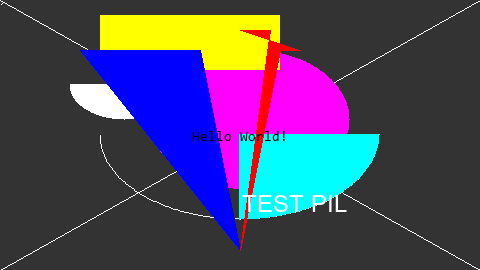

===================================
Python-PIL
===================================

-----------------------------------
Python-PIL-概览
-----------------------------------

PIL库概览
===================================

PIL库教程系列大部分翻译自官方文档: https://pillow.readthedocs.io, 使用的 PIL 版本号为 **4.3.x**.

使用Image对象
===================================

::

    import PIL.Image

    im = PIL.Image.open('jp.jpg')
    im.show()

保存图像
===================================

::

    im.save('jp.png')

PIL 在保存图像时, 会自动根据文件后缀名进行格式转化.

缩略图
===================================

::

    im.thumbnail((160, 120))
    im.show()

`thumbnail` 方法会将图像转换为缩略图. 
此方法修改图像为本身的缩略图版本, 缩略图不大于给定大小.

属性
===================================

::

    print(im.format, im.size, im.mode)
    # JPEG (960, 540) RGB

裁剪，粘贴与合并图像
===================================

::

    # 裁剪
    box = (100, 100, 400, 400)
    region = im.crop(box)

    # 旋转裁剪的图像, 并粘贴回原位置
    region = region.transpose(PIL.Image.ROTATE_180)
    im.paste(region, box)
    im.show()

当将子图像粘贴至父原图时, 子图像的大小必须与给定区域完全匹配. 
此外, 该区域不能扩展到父图像之外. 

但是, 子图像和父图像的模式 (mode) 不需要匹配. 
在粘贴之前, 子图像会自动转换至父图像的模式.

滚动图像
===================================

::

    def roll(image, delta):
        """Roll an image sideways.
        """
        xsize, ysize = image.size

        delta = delta % xsize
        if delta == 0:
            return image

        part1 = image.crop((0, 0, delta, ysize))
        part2 = image.crop((delta, 0, xsize, ysize))
        part1.load()
        part2.load()
        image.paste(part2, (0, 0, xsize - delta, ysize))
        image.paste(part1, (xsize - delta, 0, xsize, ysize))

        return image

    roll(im, 100).show()

.. image:: http://accu.cc/img/pil/pil_tutorial_overview/roll.gif
    :height: 270px
    :width: 480px

请注意, 当从 `crop()` 操作中将其粘贴回时, 将首先调用 `load()`. 这是因为裁剪是一个惰性操作. 
如果未调用 `load()`, 则在粘贴命令中使用图像之前, 将不会执行裁剪操作. 
这将意味着 part1 将从已由第一个粘贴修改的图像版本中裁剪出来.

分离与合并通道
===================================

::

    r, g, b = im.split()
    im = PIL.Image.merge('RGB', (b, g, r))
    im.show()

简单几何变换
===================================

::

    out = im.resize((128, 128))
    out = im.rotate(45) # degrees counter-clockwise

`resize` 与 `rotate` 方法会返回一个新的 Image 对象.

模式转换
===================================

::

    out = im.convert(mode='L')

可选的模式包括:

- `1` (1-bit pixels, black and white, stored with one pixel per byte)
- `L` (8-bit pixels, black and white)
- `P` (8-bit pixels, mapped to any other mode using a color palette)
- `RGB` (3x8-bit pixels, true color)
- `RGBA` (4x8-bit pixels, true color with transparency mask)
- `CMYK` (4x8-bit pixels, color separation)
- `YCbCr` (3x8-bit pixels, color video format) Note that this refers to the JPEG, and not the ITU-R BT.2020, standard
- `LAB` (3x8-bit pixels, the L*a*b color space)
- `HSV` (3x8-bit pixels, Hue, Saturation, Value color space)
- `I` (32-bit signed integer pixels)
- `F` (32-bit floating point pixels)

滤镜
===================================

::

    import PIL.ImageFilter

    out = im.filter(PIL.ImageFilter.DETAIL)

可选的滤镜包括:

- BLUR
- CONTOUR
- DETAIL
- EDGE_ENHANCE
- EDGE_ENHANCE_MORE
- EMBOSS
- FIND_EDGES
- SMOOTH
- SMOOTH_MORE
- SHARPEN

像素操作
===================================

使用 `point()` 方法对图像的每一个像素做相应操作.

::

    # 反色: 所有像素点 i 会被 255 - i 替换
    out = im.point(lambda i: 255-i)
    out.show()

图像增强
===================================

::

    import PIL.ImageEnhance

    # 对比度调整
    enh = PIL.ImageEnhance.Contrast(im)
    enh.enhance(1.3).show()

读取GIF动画
===================================

::

    im = PIL.Image.open('sample.gif')
    im.seek(20)
    im.show()

使用迭代器读取

::

    import PIL.ImageSequence

    im = PIL.Image.open('sample.gif')
    for frame in PIL.ImageSequence.Iterator(im):
        print(frame)

关于读取图像的更多说明
===================================

大多数时候, 通过传入文件名至 `open()` 函数读取一张图像. 
但同时你也可以使用其他方式读取图像:

::

    import io
    import PIL.Image
    import numpy as np

    # 从 fp 中读取
    with open('jp.jpg', 'rb') as fp:
        im = PIL.Image.open(fp)

    # 从字符串中读取
    im = PIL.Image.open(io.StringIO('...'))

    # 从矩阵中读取
    im = PIL.Image.fromarray(255 * np.ones((100, 100)))

采样器
===================================

PIL 支持如下 6 种采样器, 均位于 `PIL.Image` 包内.

- NEAREST
- BOX
- BILINEAR
- HAMMING
- BICUBIC
- LANCZOS

显示图像
===================================

在调试过程中, 使用 `im.show()` 可以方便的展示图像, 但同时也可以借助一些其他方式展示图像, 如 `matplotlib` 和 `opencv`

::

    import PIL.Image

    im = PIL.Image.new('RGB', (480, 270), color=(0xFF, 0xCC, 0x33))
    im.show()

    import matplotlib.pyplot as plt
    plt.imshow(im)
    plt.axis('off')
    plt.show()

    import cv2
    import scipy.misc
    cv2.imshow("im", scipy.misc.fromimage(im))
    cv2.waitKey(0)
    cv2.destroyAllWindows()

-----------------------------------
Python-PIL-Image
-----------------------------------

合并图像
===================================

合并图像可以使用 `PIL.Image.alpha_composite`, `PIL.Image.blend` 和 `PIL.Image.composite`, 这里简单演示下第一种方式:

::

    import PIL.Image
    import numpy as np

    im = PIL.Image.open('jp.jpg')
    im = im.convert('RGBA')

    mask_mat = np.zeros((im.size[1], im.size[0], 4), dtype=np.uint8)
    mask_mat[:, :, 0] = np.ones((im.size[1], im.size[0]), dtype=np.uint8) * 0xFF
    mask_mat[:, :, 1] = np.ones((im.size[1], im.size[0]), dtype=np.uint8) * 0xCC
    mask_mat[:, :, 2] = np.ones((im.size[1], im.size[0]), dtype=np.uint8) * 0x33
    mask_mat[:, :, 3] = np.ones((im.size[1], im.size[0]), dtype=np.uint8) * 80
    mask = PIL.Image.fromarray(mask_mat)

    # 为原图像添加 (0xFF, 0xCC, 0x33, 80) 的蒙版
    im = PIL.Image.alpha_composite(im, mask)
    im.show()

.. image:: http://accu.cc/img/pil/pil_image/alpha_composite.jpg

对每个像素点进行操作
===================================

`PIL.Image.eval` 将指定的函数应用在图像的每一个像素点之上.

::

    import PIL.Image

    im = PIL.Image.open('jp.jpg')
    # 使用 lambda x: 255-x 取反色
    im = PIL.Image.eval(im, lambda x: 255-x)
    im.show()

.. image:: http://accu.cc/img/pil/pil_image/invert_color.jpg

分离与合并通道
===================================

::

    import PIL.Image

    im = PIL.Image.open('jp.jpg')
    # 分离每个通道, 返回 Image 元组
    r, g, b = im.split()
    # 合并多个通道, 参数 Image 元组
    im = PIL.Image.merge('RGB', (r, g, b))

    # 如果你只期望获得一个通道的 Image, 则可以使用 getchannel()
    r = im.getchannel('R')
    r.show()

    # 获取图像像素数据
    mat = list(im.getdata())
    print(mat[0]) # (84, 70, 59)
    # 获取图像一个通道的像素数据
    mat = list(im.getdata(0))
    print(mat[0]) # 84

创建新的图像
===================================

::

    import PIL.Image

    im = PIL.Image.new('RGB', (480, 270), color=(0xFF, 0xCC, 0x33))
    im.show()

获取与更新像素点
===================================

使用两个方法: `getpixel` 与 `putpixel`.

::

    import PIL.Image

    im = PIL.Image.open('jp.jpg')

    # 获取其中一个像素点
    print(im.getpixel((40, 40)))
    # (87, 84, 77)

    # 更新其中一个像素点
    im.putpixel((40, 40), (0, 0, 0))

直方图
===================================

::

    import matplotlib.pyplot as plt
    import numpy as np
    import PIL.Image

    im = PIL.Image.open('jp.jpg')
    im = im.convert('L')

    ax = plt.subplot()
    ax.bar(np.arange(0, 256), im.histogram())
    plt.show()

.. image:: http://accu.cc/img/pil/pil_image/histogram.jpg

应用滤波器
===================================

::

    import PIL.Image
    import PIL.ImageFilter

    im = PIL.Image.open('jp.jpg')
    im = im.filter(PIL.ImageFilter.GaussianBlur) # 高斯滤波
    im.show()

属性
===================================

::

    import PIL.Image

    im = PIL.Image.open('jp.jpg')
    print(im.filename)  # jp.jpg
    print(im.format)  # JPEG
    print(im.mode)  # RGB
    print(im.size)  # (480, 270)
    print(im.width)  # 480
    print(im.height)  # 270
    print(im.palette) # None
    print(im.info) # {'jfif': 257, 'jfif_version': (1, 1), 'jfif_unit': 0, 'jfif_density': (1, 1)}

-----------------------------------
Python-PIL-ImageChops
-----------------------------------

`PIL.ImageChops` 包含一系列的图像算术操作.

加法
===================================

::

    import PIL.Image
    import PIL.ImageChops

    im1 = PIL.Image.new('RGB', (480, 270), (0, 255, 0))
    im2 = PIL.Image.new('RGB', (480, 270), (255, 0, 0))

    # out = ((image1 + image2) / scale + offset)
    im = PIL.ImageChops.add(im1, im2)
    im.show()

    # out = ((image1 + image2) % MAX)
    im = PIL.ImageChops.add_modulo(im1, im2)
    im.show()

减法
===================================

::

    # out = ((image1 - image2) / scale + offset)
    im = PIL.ImageChops.subtract(im1, im2)
    im.show()

    # out = ((image1 - image2) % MAX)
    im = PIL.ImageChops.subtract_modulo(im1, im2)
    im.show()

乘法
===================================

::

    # out = image1 * image2 / MAX
    im = PIL.ImageChops.multiply(im1, im2)
    im.show()

最大值
===================================

::

    # out = max(image1, image2)
    im = PIL.ImageChops.lighter(im1, im2)
    im.show()

最小值
===================================

::

    # out = min(image1, image2)
    im = PIL.ImageChops.darker(im1, im2)
    im.show()

差异
===================================

::

    # out = abs(image1 - image2)
    im = PIL.ImageChops.difference(im1, im2)
    im.show()

反色
===================================

::

    # out = MAX - image
    im = PIL.ImageChops.invert(im1)
    im.show()

逻辑操作
===================================

::

    # out = ((image1 and image2) % MAX)
    im = PIL.ImageChops.logical_and(im1, im2)
    im.show()

    # out = ((image1 or image2) % MAX)
    im = PIL.ImageChops.logical_or(im1, im2)
    im.show()

逻辑操作的参数图像模式必须是 1.

-----------------------------------
Python-PIL-ImageColor
-----------------------------------

`PIL.ImageColor` 包含两个将字符串转换为颜色值的函数 `getrgb()` 与 `getcolor()`.

::

    import PIL.ImageColor

    # getrgb(color) 返回 (red, green, blue[, alpha])
    print(PIL.ImageColor.getrgb('#FFCC33'))
    print(PIL.ImageColor.getrgb('rgb(255, 204, 51)'))
    print(PIL.ImageColor.getrgb('rgb(100%,0%,0%)'))
    print(PIL.ImageColor.getrgb('hsl(0,100%,50%)'))
    # 颜色名称作为参数传入, 允许的名称定义在 PIL.ImageColor.colormap 中
    print(PIL.ImageColor.getrgb('pink'))

    # getcolor(color, mode) 返回 (graylevel [, alpha]) 或 (red, green, blue[, alpha])
    print(PIL.ImageColor.getcolor('#FFCC33', 'L'))

-----------------------------------
Python-PIL-ImageDraw
-----------------------------------

`PIL.ImageDraw` 提供简单的 2D 绘图功能. 你可以使用它创建新的图像或修改已有的图像.

绘制线段
===================================

::

    import PIL.Image
    import PIL.ImageDraw

    im = PIL.Image.new('RGB', (480, 270), '#333333')
    draw = PIL.ImageDraw.Draw(im)
    draw.line((0, 0) + im.size, fill='#FFFFFF')
    draw.line((0, im.size[1], im.size[0], 0), fill='#FFFFFF')
    im.show()

.. image:: http://accu.cc/img/pil/pil_imagedraw/line.jpg

绘制离散的点
===================================

::

    draw.point([(x1, y1), (x2, y2), (x3, y3)...], fill='#FFFFFF')

绘制圆弧
===================================

`PIL.ImageDraw.Draw.arc` 方法可以在给定的矩形选框内绘制一段(内切)圆弧. 绘制起点为 3 点钟位置.

::

    import PIL.Image
    import PIL.ImageDraw

    im = PIL.Image.new('RGB', (480, 270), '#333333')
    draw = PIL.ImageDraw.Draw(im)
    draw.arc((100, 50, 379, 219), 0, 180, fill='#FFFFFF')
    im.show()

.. image:: http://accu.cc/img/pil/pil_imagedraw/arc.jpg

`PIL.ImageDraw.Draw.chord` 方法与 `PIL.ImageDraw.Draw.arc` 类似, 不同的是会填充圆弧.

::

    import PIL.Image
    import PIL.ImageDraw

    im = PIL.Image.new('RGB', (480, 270), '#333333')
    draw = PIL.ImageDraw.Draw(im)
    draw.chord((100, 50, 379, 219), 0, 180, fill='#FFFFFF')
    im.show()

.. image:: http://accu.cc/img/pil/pil_imagedraw/chord.jpg

`PIL.ImageDraw.Draw.ellipse` 方法绘制并填充椭圆.

::

    import PIL.Image
    import PIL.ImageDraw

    im = PIL.Image.new('RGB', (480, 270), '#333333')
    draw = PIL.ImageDraw.Draw(im)
    draw.ellipse((100, 50, 379, 219), fill='#FFFFFF')
    im.show()

.. image:: http://accu.cc/img/pil/pil_imagedraw/ellipse.jpg

`PIL.ImageDraw.Draw.pieslice` 方法绘制并填充扇形.

::

    import PIL.Image
    import PIL.ImageDraw

    im = PIL.Image.new('RGB', (480, 270), '#333333')
    draw = PIL.ImageDraw.Draw(im)
    draw.pieslice((100, 50, 379, 219), 0, 90, fill='#FFFFFF')
    im.show()

.. image:: http://accu.cc/img/pil/pil_imagedraw/pieslice.jpg

绘制矩形
===================================

::

    import PIL.Image
    import PIL.ImageDraw

    im = PIL.Image.new('RGB', (480, 270), '#333333')
    draw = PIL.ImageDraw.Draw(im)
    draw.rectangle((100, 50, 379, 219), fill='#FFFFFF')
    im.show()

.. image:: http://accu.cc/img/pil/pil_imagedraw/rectangle.jpg

绘制多边形
===================================

::

    import PIL.Image
    import PIL.ImageDraw

    im = PIL.Image.new('RGB', (480, 270), '#333333')
    draw = PIL.ImageDraw.Draw(im)
    draw.polygon([(100, 50), (380, 50), (240, 250)], fill='#FFFFFF')
    im.show()

.. image:: http://accu.cc/img/pil/pil_imagedraw/polygon.jpg

绘制文字
===================================

::

    import PIL.Image
    import PIL.ImageDraw
    import PIL.ImageFont

    font = PIL.ImageFont.truetype('consola', 14)
    im = PIL.Image.new('RGB', (480, 270), '#333333')
    draw = PIL.ImageDraw.Draw(im)
    print(draw.textsize('Hello World!', font)) # (96, 10), 返回字符串将要占用的像素区域大小
    draw.text((192, 130), 'Hello World!', '#FFFFFF', font)
    im.show()

.. image:: http://accu.cc/img/pil/pil_imagedraw/text.jpg

与 `draw.text` 类似的还有一个 `draw.multiline_text` 方法, 不多做介绍.

Summary
==========

::

    # coding: utf-8

    import PIL.Image
    import PIL.ImageDraw
    import PIL.ImageFont

    im = PIL.Image.new('RGB', (480, 270), '#333333')
    # im.show()
    draw = PIL.ImageDraw.Draw(im)

    # 绘制线段
    draw.line((0, 0) + im.size, fill='#FFFFFF')
    draw.line((0, im.size[1], im.size[0], 0), fill='#FFFFFF')

    # 绘制离散的点
    draw.point([(2, 3), (3, 2), (1, 4)], fill='#FFFFFF')

    # 绘制圆弧
    draw.arc((100, 50, 379, 219), 0, 180, fill='#FFFFFF')
    draw.chord((70, 50, 179, 119), 0, 180, fill='#FFFFFF')
    draw.ellipse((150, 50, 349, 189), fill='#FF00FF')
    draw.pieslice((100, 50, 379, 219), 0, 90, fill='#00FFFF')

    # 绘制矩形
    draw.rectangle((100, 15, 279, 69), fill='#FFFF00')

    # 绘制多边形
    draw.polygon([(200, 50), (80, 50), (240, 250)], fill='#0000FF')
    draw.polygon([(300, 50), (280, 50), (240, 250),
        (270, 30), (240, 30)], fill='#FF0000')

    # 绘制文字
    font = PIL.ImageFont.truetype('consola', 14)
    print(draw.textsize('Hello World!', font))
    draw.text((192, 130), 'Hello World!', '#000000', font)

    font = PIL.ImageFont.truetype('arial', 24)
    print(draw.textsize('TEST PIL', font))
    draw.text((242, 190), 'TEST PIL', '#FFFFFF', font)

    im.show()
    im.save('4pil_imagechops.bmp')
    '''
    (96, 11)
    (105, 22)
    [Finished in 2.7s]
    '''

-----------------------------------
Python-PIL-ImageEnhance
-----------------------------------

`PIL.ImageEnhance` 包含一系列的图像增强算法.

色彩平衡度
===================================

`PIL.ImageEnhance.Color`

::

    import PIL.Image
    import PIL.ImageEnhance

    im = PIL.Image.open('jp.jpg')
    enhancer = PIL.ImageEnhance.Color(im)
    # 从灰度图逐渐恢复到原图
    for i in range(11):
        enhancer.enhance(i / 10.0).show()

.. image:: http://accu.cc/img/pil/pil_imageenhance/color.gif
    :height: 270px
    :width: 480px

对比度
===================================

`PIL.ImageEnhance.Contrast`

::

    import PIL.Image
    import PIL.ImageEnhance

    im = PIL.Image.open('jp.jpg')
    enhancer = PIL.ImageEnhance.Contrast(im)
    enhancer.enhance(0.5).show()
    enhancer.enhance(2.0).show()

亮度
===================================

`PIL.ImageEnhance.Brightness`

::

    import PIL.Image
    import PIL.ImageEnhance

    im = PIL.Image.open('jp.jpg')
    enhancer = PIL.ImageEnhance.Brightness(im)
    enhancer.enhance(0.5).show()
    enhancer.enhance(2.0).show()

锐化
===================================

`PIL.ImageEnhance.Sharpness`

::

    import PIL.Image
    import PIL.ImageEnhance

    im = PIL.Image.open('jp.jpg')
    enhancer = PIL.ImageEnhance.Sharpness(im)
    # 低于 1 时模糊, 高于 1 时锐化
    enhancer.enhance(0.5).show()
    enhancer.enhance(2.0).show()

-----------------------------------
Python-PIL-ImageOps
-----------------------------------

`PIL.ImageOps` 包含一些预定义的图像处理操作, 大多数只工作于 `L` 和 `RGB` 模式下.

自动调整对比度
===================================

::

    im = PIL.ImageOps.autocontrast(image, cutoff=0, ignore=None)

该函数计算图像的直方图, 移除最大和最小的 `cutoff` 百分比像素, 并将像素范围拉伸到 0 - 255.

灰度图着色
===================================

::

    im = PIL.ImageOps.colorize(image, black, white)

着色一幅灰度图. 参数中的 `black` 和 `white` 需要为 RGB 颜色.

移除或添加指定像素的边框
===================================

::

    # 移除边框
    im = PIL.ImageOps.crop(image, border=0)

    # 添加边框
    im = PIL.ImageOps.expand(image, border=0, fill=0)

移除图像上下左右 `border` 像素.

直方图均衡化
===================================

::

    im = PIL.ImageOps.equalize(image, mask=None)

翻转图像
===================================

::

    # 上下翻转
    im =  PIL.ImageOps.flip(image)

    # 左右翻转
    im = PIL.ImageIps.mirror(image)

反色
===================================

::

    im = PIL.ImageOps.invert(image)

降低颜色位数
===================================

::

    im = PIL.ImageOps.posterize(image, bits)

`bits` 为每个通道保留的颜色位数, 范围 (1-8).

